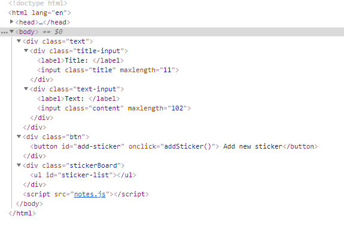
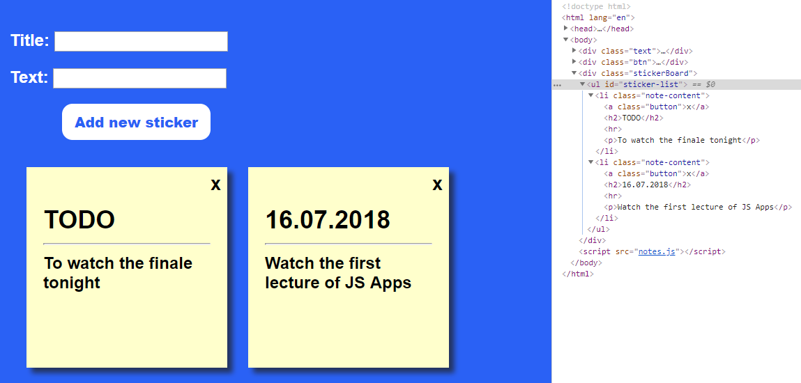
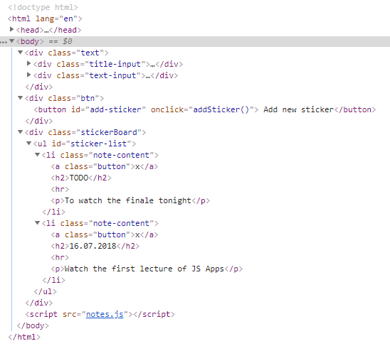
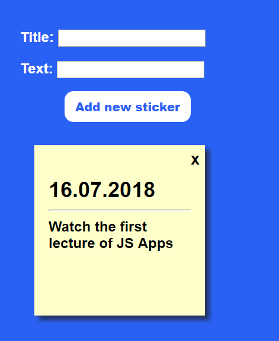
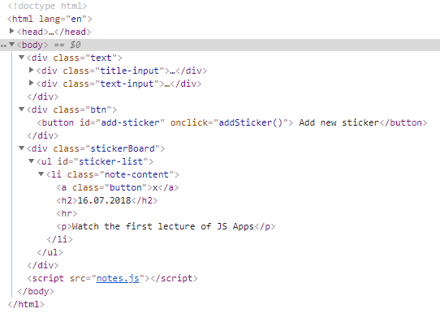

# JS Advanced: Exam 15 July 2018

# Problem 1. Sticky Notes (Simple DOM Interaction)

You are given the following **HTML code**:

<table>
  <tr>
    <td>notes.html</td>
  </tr>
  <tr>
    <td><!DOCTYPE html>
<html lang="en">
<head>
    <meta charset="UTF-8">
    <title>Sticky Notes</title>
    
    
</head>
<body>

    

        <label>Title: </label>
        <input class="title" maxlength="11">
    

    

        <label>Text: </label>
        <input class="content" maxlength="102">
    



    <button id="add-sticker" onclick="addSticker()"> Add new sticker</button>


    <ul id="sticker-list"></ul>


</body>
</html></td>
  </tr>
</table>

### Your Task

**Write the** **missing JavaScript code** to make the **Notes board** work as expected.

    * When **both** **Title** and **Text** are **filled** upon pressing the "**Add new sticker**" button, a new sticker should appear in the sticker board and the input fields should be **reset**. Every sticker **must** have title, text and close button. Otherwise don't create note.

    * **Between** the Title and Text content of the note you should have **separating** line.

    * When the **close** button is clicked, the sticker should **disappear** from the sticker board.

### Submission

Submit only your **addSticker** function.

### Examples

**Example of empty html:**

**Example of visualization and html after adding stickers:**

**Example after removing the first note:**

 

