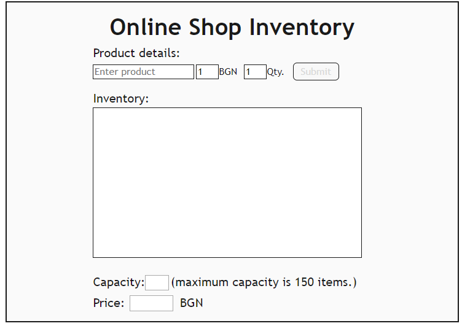
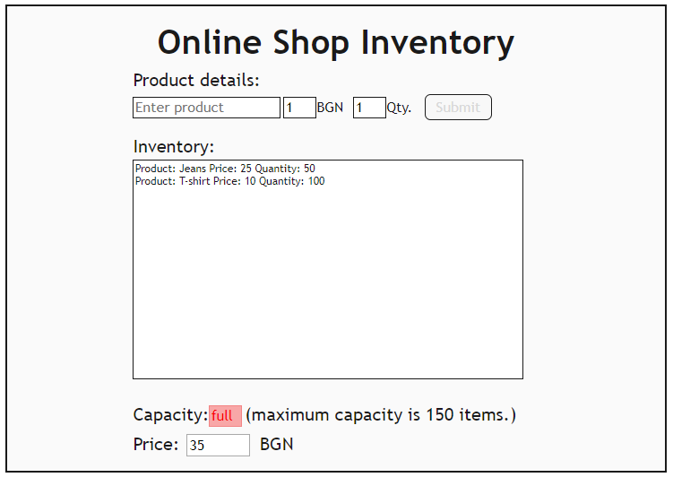

# JS Advanced: Exam 15 July 2018

# Problem 4. Online Shop (DOM)

Write a JavaScript program that provides the logic for the given user interface of an online shop’s inventory:

Each order you create should consist of product's **name**, **price** and **quantity**. When the **submit** button is **clicked** the current **product** must be **added** to the inventory and the visualization (**product field, price field, quantity field and submit button**) should be **reset** to the **initial values**. The **submit button** should be **disabled** if the **product field** **is empty**. 

Also there is a small **capacity** **field**, which shows how many items are there currently in the inventory. The inventory can store **up to 150 items**. Therefore, you should keep track of its capacity and when **150** items are **reached**, the capacity field should **become red** and it should display **"full"**, also the **submit button, the product field, price field and quantity field** should be **disabled **by adding to them the property “disabled”. In order to change the colour of the capacity field, you should simply **change** its **CSS class** to **“fullCapacity”**. See the picture below:

### Output

* You should **only** **submit **the** solution.js file**

Use the following **index.html** and the **solution.js** for the user interface implementation: 

<table>
  <tr>
    <td>index.html</td>
  </tr>
  <tr>
    <td><!DOCTYPE html>
<html lang="en">

<head>
    <meta charset="UTF-8">
    <title>Online Shop</title>
    
    

</head>

<body>




</body>
</td>
  </tr>
</table>

<table>
  <tr>
    <td>solution.js</td>
  </tr>
  <tr>
    <td>function onlineShop(selector) {
    let form = `
Online Shop Inventory

    

        <label class="field">Product details:</label>
         
        <input placeholder="Enter product" class="custom-select">
        <input class="input1" id="price" type="number" min="1" max="999999" value="1"><label class="text">BGN</label>
        <input class="input1" id="quantity" type="number" min="1" value="1"><label class="text">Qty.</label>
        <button id="submit" class="button" disabled>Submit</button>
          
        <label class="field">Inventory:</label>
         
        <ul class="display">
        </ul>
         
        <label class="field">Capacity:</label><input id="capacity" readonly>
        <label class="field">(maximum capacity is 150 items.)</label>
         
        <label class="field">Price:</label><input id="sum" readonly>
        <label class="field">BGN</label>
    
`;
    $(selector).html(form);
    // Write your code here
}</td>
  </tr>
</table>

