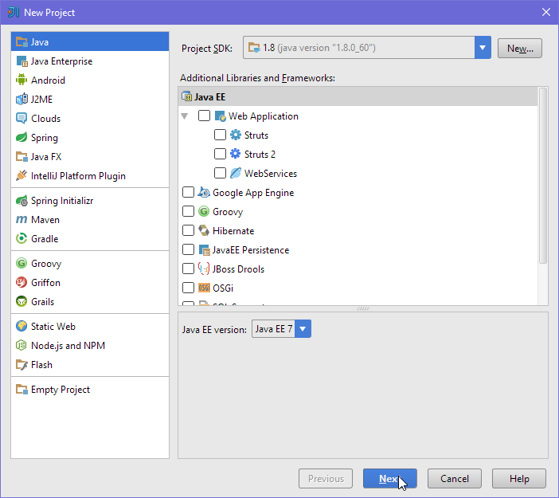
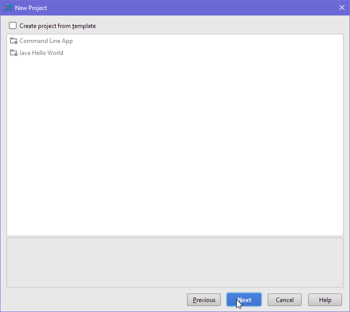
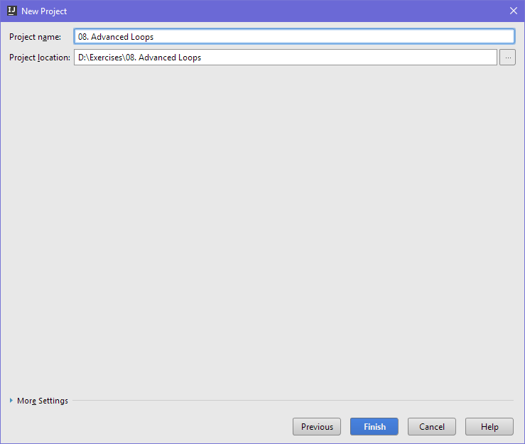
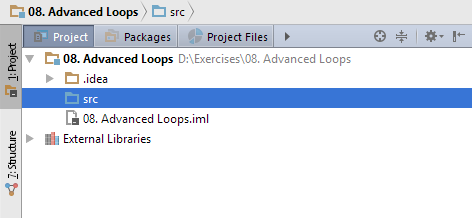
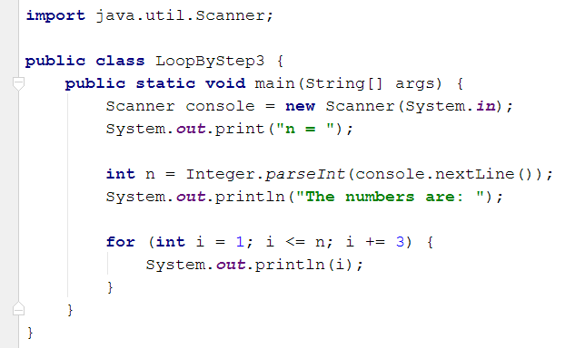
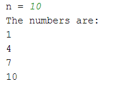
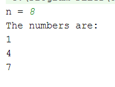

# Упражнения: Работа с по-сложни цикли

Задачи за упражнение в клас и за домашно към курса [„Основи на програмирането" @ СофтУни](https://softuni.bg/courses/programming-basics).

# 1. Празно IntelliJ решение (Blank Project)

Създайте празно решение (Blank Project) във IntelliJ. Класовете в IntelliJ обединяват група проекти. Тази възможност е изключително удобна, когато искаме да работим по няколко проекта и бързо да превключваме между тях или искаме да обединим логически няколко взаимосвързани проекта.

В настоящото практическо занимание ще използваме Java проект и няколко класа, за да ор**г**анизираме решенията на задачите от упражненията – всяка задача в отделен клас в общ проект.

1. Стартирайте IntelliJ IDEA.

2. Създайте нов проект: [Create New Project].

3. Изберете от диалоговия прозорец [Java] → [Next] → [Next] и дайте подходящо име на проекта, например „**Advanced Loops**":

➔

Сега имате създаден **празен IntelliJ проект** (с 0 пакета в него):

Целта на този **blank project** e да добавяте в него **по един пакет за всяка задача** от упражненията.

# 2. Числата от 1 до N през 3

Напишете програма, която чете число **n**, въведено от потребителя, и отпечатва **числата от 1 до** **n** **през 3** (със стъпка 3). Примери:

<table>
  <tr>
    <td>вход</td>
    <td>изход</td>
    <td></td>
    <td>вход</td>
    <td>изход</td>
    <td></td>
    <td>вход</td>
    <td>изход</td>
  </tr>
  <tr>
    <td>10</td>
    <td>1
4
7
10</td>
    <td></td>
    <td>7</td>
    <td>1
4
7</td>
    <td></td>
    <td>15</td>
    <td>1
4
7
10
13</td>
  </tr>
</table>

**Подсказки**:

1. Създайте **нов проект** в съществуващото IntelliJ решение – конзолна Java програма. Задайте подходящо име на проекта, например "**p01_****LoopByStep3**".

2. Можете да завъртите **for****-цикъл със стъпка 3 **по следния начин: **for (int i** **=** **1; i** **<=** **n; i+=3)**.

3. Отидете в тялото на метода **main(String[]** **args)** и напишете решението на задачата. Можете да си помогнете с кода от картинката по-долу:

4. **Стартирайте** програмата с [Ctrl+Shift+F10] и я **тествайте**:

	

5. **Тествайте **решението си в** judge системата**: [https://judge.softuni.bg/Contests/Practice/Index/156#0](https://judge.softuni.bg/Contests/Practice/Index/156#0). Трябва да получите **100 точки** (напълно коректно решение).

# 3. Числата от N до 1 в обратен ред

Напишете програма, която чете цяло положително число **n**, въведено от потребителя, и печата **числата от** **n** **до** **1** **в обратен ред** (от най-голямото към най-малкото). Примери:

<table>
  <tr>
    <td>вход</td>
    <td>изход</td>
    <td></td>
    <td>вход</td>
    <td>изход</td>
    <td></td>
    <td>вход</td>
    <td>изход</td>
  </tr>
  <tr>
    <td>2</td>
    <td>2
1</td>
    <td></td>
    <td>3</td>
    <td>3
2
1</td>
    <td></td>
    <td>5</td>
    <td>5
4
3
2
1</td>
  </tr>
</table>

**Тествайте **решението си в** judge системата**: [https://judge.softuni.bg/Contests/Practice/Index/156#1](https://judge.softuni.bg/Contests/Practice/Index/156#1).

**Подсказка**: отпечатайте **n** звездички в цикъл **n** пъти, точно както в предната задача.

# 4. Числа от 1 до 2n

Напишете програма, която чете от конзолата цяло число **n**, въведено от потребителя, и **печата числата от 1 до 2****n**. Примери:

<table>
  <tr>
    <td>вход</td>
    <td>изход</td>
    <td></td>
    <td>вход</td>
    <td>изход</td>
    <td></td>
    <td>вход</td>
    <td>изход</td>
  </tr>
  <tr>
    <td>3</td>
    <td>1
2
4
8</td>
    <td></td>
    <td>4</td>
    <td>1
2
4
8
16</td>
    <td></td>
    <td>5</td>
    <td>1
2
4
8
16
32</td>
  </tr>
</table>

**Тествайте **решението си в** judge системата**: [https://judge.softuni.bg/Contests/Practice/Index/156#2](https://judge.softuni.bg/Contests/Practice/Index/156#2).

**Подсказка**: завъртете **for**-цикъл от **0** до **n** и започвайки от **num** = **1** на всяка стъпка умножавайте **num** по **2**.

# 5. Четни степени на 2

Да се напише програма, която чете число **n**, въведено от потребителя, и **печата четните степени на 2** **≤** **2****n**: **2****0**, **2****2**, **2****4**, **2****8**, …, **2****n**. 

Примери:

<table>
  <tr>
    <td>вход</td>
    <td>изход</td>
    <td></td>
    <td>вход</td>
    <td>изход</td>
    <td></td>
    <td>вход</td>
    <td>изход</td>
    <td></td>
    <td>вход</td>
    <td>изход</td>
    <td></td>
    <td>вход</td>
    <td>изход</td>
  </tr>
  <tr>
    <td>3</td>
    <td>1
4</td>
    <td></td>
    <td>4</td>
    <td>1
4
16</td>
    <td></td>
    <td>5</td>
    <td>1
4
16</td>
    <td></td>
    <td>6</td>
    <td>1
4
16
64</td>
    <td></td>
    <td>7</td>
    <td>1
4
16
64</td>
  </tr>
</table>

**Тествайте **решението си в** judge системата**: [https://judge.softuni.bg/Contests/Practice/Index/156#3](https://judge.softuni.bg/Contests/Practice/Index/156#3).

**Подсказка**: започнете от 1 и в цикъл умножавайте по 4 на всяка стъпка.

# 6. Редица числа 2k+1

Напишете програма, която чете число **n**, подадено от потребителя,** **и отпечатва **всички числа ≤ n от редицата**: 1, 3, 7, 15, 31, …. Всяко следващо число се изчислява като **предишното число * 2 + 1**. Примери:

<table>
  <tr>
    <td>вход</td>
    <td>изход</td>
    <td></td>
    <td>вход</td>
    <td>изход</td>
    <td></td>
    <td>вход</td>
    <td>изход</td>
    <td></td>
    <td>вход</td>
    <td>изход</td>
  </tr>
  <tr>
    <td>3</td>
    <td>1
3</td>
    <td></td>
    <td>8</td>
    <td>1
3
7</td>
    <td></td>
    <td>17</td>
    <td>1
3
7
15</td>
    <td></td>
    <td>31</td>
    <td>1
3
7
15
31</td>
  </tr>
</table>

**Тествайте **решението си в** judge системата**: [https://judge.softuni.bg/Contests/Practice/Index/156#4](https://judge.softuni.bg/Contests/Practice/Index/156#4).

**Подсказки**:

* Започнете от **num** = **1**.

* В цикъл докато **num** не стигне **n**, печатайте, го умножавайте по **2** и прибавяйте **1**.

# 7. Число в диапазона [1…100]

Напишете програма, която чете цяло положително **число **n** в диапазона [1…100**], въведено от потребителя. При въвеждане на число извън посочения диапазон, да се отпечата съобщение за грешка и потребителят да се подкани **да въведе ново число**. Примери:

<table>
  <tr>
    <td>вход / изход</td>
  </tr>
  <tr>
    <td>Еnter a number in the range [1...100]: 35
The number is: 35</td>
  </tr>
  <tr>
    <td>Еnter a number in the range [1...100]: 105
Invalid number!
Еnter a number in the range [1...100]: 0
Invalid number!
Еnter a number in the range [1...100]: -200
Invalid number!
Еnter a number in the range [1...100]: 77
The number is: 77</td>
  </tr>
</table>

**Тествайте **решението си в** judge системата**: [https://judge.softuni.bg/Contests/Practice/Index/156#5](https://judge.softuni.bg/Contests/Practice/Index/156#5).

**Подсказки**:

* Въведете число.

* Повтаряйте в цикъл докато числото е невалидно: отпечатайте грешка и въведете число отново.

# 8. Най-голям общ делител (НОД)

Напишете програма, която чете две цели положителни числа **a** и **b**, въведени от потребителя, и изчислява и отпечатва **най-големият им общ делител (НОД)**. Примери:

<table>
  <tr>
    <td>вход</td>
    <td>изход</td>
    <td></td>
    <td>вход</td>
    <td>изход</td>
    <td></td>
    <td>вход</td>
    <td>изход</td>
    <td></td>
    <td>вход</td>
    <td>изход</td>
    <td></td>
    <td>вход</td>
    <td>изход</td>
  </tr>
  <tr>
    <td>24
16</td>
    <td>8</td>
    <td></td>
    <td>67
18</td>
    <td>1</td>
    <td></td>
    <td>15
9</td>
    <td>3</td>
    <td></td>
    <td>100
88</td>
    <td>4</td>
    <td></td>
    <td>10
10</td>
    <td>10</td>
  </tr>
</table>

**Тествайте **решението си в** judge системата**: [https://judge.softuni.bg/Contests/Practice/Index/156#6](https://judge.softuni.bg/Contests/Practice/Index/156#6).

**Подсказка**: имплементирайте **алгоритъма на Евклид**: [https://bg.wikipedia.org/wiki/алгоритъм-на-Евклид](https://bg.wikipedia.org/wiki/алгоритъм-на-Евклид%D0%90%D0%BB%D0%B3%D0%BE%D1%80%D0%B8%D1%82%D1%8A%D0%BC_%D0%BD%D0%B0_%D0%95%D0%B2%D0%BA%D0%BB%D0%B8%D0%B4).

# 9. Факториел

Напишете програма, която чете цяло число **n** (1 ≤ **n** ≤ 12), въведено от потребителя, и **изчислява и отпечатва** **n!** = 1 * 2 * … * **n** (**n** **факториел**). Примери: 

<table>
  <tr>
    <td>вход</td>
    <td>изход</td>
    <td></td>
    <td>вход</td>
    <td>изход</td>
    <td></td>
    <td>вход</td>
    <td>изход</td>
    <td></td>
    <td>вход</td>
    <td>изход</td>
    <td></td>
    <td>вход</td>
    <td>изход</td>
  </tr>
  <tr>
    <td>5</td>
    <td>120</td>
    <td></td>
    <td>6</td>
    <td>720</td>
    <td></td>
    <td>10</td>
    <td>3628800</td>
    <td></td>
    <td>1</td>
    <td>1</td>
    <td></td>
    <td>2</td>
    <td>2</td>
  </tr>
</table>

**Тествайте **решението си в** judge системата**: [https://judge.softuni.bg/Contests/Practice/Index/156#7](https://judge.softuni.bg/Contests/Practice/Index/156#7).

**Подсказка**: в цикъл умножете числата от **1** до **n**.

# 10. Сумиране на цифрите на число

Напишете програма, която чете цяло число **num**, въведено от потребителя, и отпечатва **сумата от цифрите му**. Примери:

<table>
  <tr>
    <td>вход</td>
    <td>изход</td>
    <td>коментар</td>
    <td></td>
    <td>вход</td>
    <td>изход</td>
    <td>коментар</td>
    <td></td>
    <td>вход</td>
    <td>изход</td>
    <td></td>
    <td>вход</td>
    <td>изход</td>
  </tr>
  <tr>
    <td>5634</td>
    <td>18</td>
    <td>6+6+3+4 = 18</td>
    <td></td>
    <td>19</td>
    <td>10</td>
    <td>1+9 = 10</td>
    <td></td>
    <td>5</td>
    <td>5</td>
    <td></td>
    <td>17151</td>
    <td>15</td>
  </tr>
</table>

**Тествайте **решението си в** judge системата**: [https://judge.softuni.bg/Contests/Practice/Index/156#8](https://judge.softuni.bg/Contests/Practice/Index/156#8).

**Подсказка**: в цикъл докато не стигнете до 0 сумирайте последната цифра на числото (**num % 10**) и го разделяйте след това на 10 (така изтривате последната му цифра).

# 11. Проверка за просто число

Напишете програма, която чете цяло число **n**, въведено от потребителя, и **проверява дали е** **просто число** (дали се дели само на себе си и на единица). Да се отпечата "**Prime**" или “**Not prime**”. Примери:

<table>
  <tr>
    <td>вход</td>
    <td>изход</td>
    <td></td>
    <td>вход</td>
    <td>изход</td>
    <td></td>
    <td>вход</td>
    <td>изход</td>
    <td></td>
    <td>вход</td>
    <td>изход</td>
    <td></td>
    <td>вход</td>
    <td>изход</td>
  </tr>
  <tr>
    <td>2</td>
    <td>Prime</td>
    <td></td>
    <td>3</td>
    <td>Prime</td>
    <td></td>
    <td>4</td>
    <td>Not Prime</td>
    <td></td>
    <td>5</td>
    <td>Prime</td>
    <td></td>
    <td>7</td>
    <td>Prime</td>
  </tr>
</table>

<table>
  <tr>
    <td>вход</td>
    <td>изход</td>
    <td></td>
    <td>вход</td>
    <td>изход</td>
    <td></td>
    <td>вход</td>
    <td>изход</td>
    <td></td>
    <td>вход</td>
    <td>изход</td>
  </tr>
  <tr>
    <td>1</td>
    <td>Not Prime</td>
    <td></td>
    <td>0</td>
    <td>Not Prime</td>
    <td></td>
    <td>-1</td>
    <td>Not Prime</td>
    <td></td>
    <td>149</td>
    <td>Prime</td>
  </tr>
</table>

**Тествайте **решението си в** judge системата**: [https://judge.softuni.bg/Contests/Practice/Index/156#9](https://judge.softuni.bg/Contests/Practice/Index/156#9).

**Подсказки**:

* Ако числото е по-малко от 2, значи не е просто.

* Всяко друго число първоначално се приема за **просто** и се проверява в цикъл дали се дели на числата 2, 3, 4, …, до корен квадратен от **n** (цялата част).

# 12. Въвеждане на четно число (с обработка на грешен вход)

Напишете програма, която **чете четно число**, въведено от потребителя. Ако потребителят въведе **грешно число** (нечетно число или стринг, който не е цяло число), трябва да му излиза **съобщение за** **грешка** и да **въвежда отново**. Примери:

<table>
  <tr>
    <td>вход / изход</td>
  </tr>
  <tr>
    <td>Enter even number: 34
Even number entered: 34</td>
  </tr>
  <tr>
    <td>Enter even number: 35
The number is not even.
Enter even number: hello
Invalid number!
Enter even number: 12.85
Invalid number!
Enter even number: 3464232636536513
Invalid number!
Enter even number: 8
Even number entered: 8</td>
  </tr>
</table>

**Тествайте **решението си в** judge системата**: [https://judge.softuni.bg/Contests/Practice/Index/156#10](https://judge.softuni.bg/Contests/Practice/Index/156#10).

**Подсказки**:

* В цикъл въвеждайте число и проверявайте дали е четно. При коректно число излезте от цикъла.

* С **try**** { … }** **catch**** { … }** конструкция прихванете грешните числа, които не могат да се обърнат в **int**.

# 13. Числа на Фибоначи

Напишете програма, която чете цяло число **n**, въведено от потребителя, и пресмята **n-тото** **число на Фибоначи**. Нулевото число на Фибоначи е 1, първото е също 1, а всяко следващо е сумата от предходните две. Примери:

<table>
  <tr>
    <td>вход</td>
    <td>изход</td>
    <td></td>
    <td>вход</td>
    <td>изход</td>
    <td></td>
    <td>вход</td>
    <td>изход</td>
    <td></td>
    <td>вход</td>
    <td>изход</td>
    <td></td>
    <td>вход</td>
    <td>изход</td>
  </tr>
  <tr>
    <td>0</td>
    <td>1</td>
    <td></td>
    <td>1</td>
    <td>1</td>
    <td></td>
    <td>2</td>
    <td>2</td>
    <td></td>
    <td>5</td>
    <td>8</td>
    <td></td>
    <td>10</td>
    <td>89</td>
  </tr>
</table>

**Тествайте **решението си в** judge системата**: [https://judge.softuni.bg/Contests/Practice/Index/156#11](https://judge.softuni.bg/Contests/Practice/Index/156#11).

**Подсказка**:

* При **n < 2** отпечатайте **1**.

* Започнете от **f0**=**1** и **f1**=**1** и в цикъл сумирайте последните две числа. Записвайте последните две числа след всяка стъпка в **f0** и **f1**.

# 14. Пирамида от числа

Напишете програма, която чете цяло число **n**, въведено от потребителя, и отпечатва **пирамида от числа** като в примерите: 

<table>
  <tr>
    <td>вход</td>
    <td>изход</td>
    <td></td>
    <td>вход</td>
    <td>изход</td>
    <td></td>
    <td>вход</td>
    <td>изход</td>
    <td></td>
    <td>вход</td>
    <td>изход</td>
  </tr>
  <tr>
    <td>7</td>
    <td>1
2 3
4 5 6
7</td>
    <td></td>
    <td>10</td>
    <td>1
2 3
4 5 6
7 8 9 10</td>
    <td></td>
    <td>12</td>
    <td>1
2 3
4 5 6
7 8 9 10
11 12</td>
    <td></td>
    <td>15</td>
    <td>1
2 3
4 5 6
7 8 9 10
11 12 13 14 15</td>
  </tr>
</table>

**Тествайте **решението си в** judge системата**: [https://judge.softuni.bg/Contests/Practice/Index/156#12](https://judge.softuni.bg/Contests/Practice/Index/156#12).

**Подсказка**:

* С **два вложени цикъла** печатайте пирамида от числа: на първия ред едно число, на втория ред 2 числа, на третия ред 3 числа и т.н.

* В отделен **брояч** пазете колко числа сте отпечатали до момента (и кое е текущото число). Когато стигнете **n**, излезте внимателно от двата вложени цикъла с **break** или **return**.

# 15. Таблица с числа

Напишете програма, която чете цяло число **n**, въведено от потребителя, и отпечатва **таблица (матрица) от числа** като в примерите: 

<table>
  <tr>
    <td>вход</td>
    <td>изход</td>
    <td></td>
    <td>вход</td>
    <td>изход</td>
    <td></td>
    <td>вход</td>
    <td>изход</td>
    <td></td>
    <td>вход</td>
    <td>изход</td>
  </tr>
  <tr>
    <td>2</td>
    <td>1 2
2 1</td>
    <td></td>
    <td>3</td>
    <td>1 2 3
2 3 2
3 2 1</td>
    <td></td>
    <td>4</td>
    <td>1 2 3 4
2 3 4 3
3 4 3 2
4 3 2 1</td>
    <td></td>
    <td>5</td>
    <td>1 2 3 4 5
2 3 4 5 4
3 4 5 4 3
4 5 4 3 2
5 4 3 2 1</td>
  </tr>
</table>

**Тествайте **решението си в** judge системата**: [https://judge.softuni.bg/Contests/Practice/Index/156#13](https://judge.softuni.bg/Contests/Practice/Index/156#13).

**Подсказка**:

* С **два вложени цикъла** за **row** (ред) и **col** (колона) печатайте число по формулата **num** = **row + col + 1**.

* За долната дясна половина на таблицата ще се получат грешни резултати. Там използвайте формулата **2*n - num**.

* Как се сетихме за тези формули? Математическа досетливост: наблюдаваме числата, предполагаме каква е формулата, тестваме и ако не се получи, измисляме друга формула и пак пробваме. В случая имаме различни формули за горната лява и долната дясна половина от матрицата.

