# Упражнения: По-сложни проверки

Задачи за упражнение в клас и за домашно към курса [„Основи на програмирането" @ СофтУни](https://softuni.bg/courses/programming-basics).

# 1. Празно IntelliJ решение (Blank Project)

Създайте празно решение (Blank Project) във IntelliJ. Класовете в IntelliJ обединяват група проекти. Тази възможност е изключително удобна, когато искаме да работим по няколко проекта и бързо да превключваме между тях или искаме да обединим логически няколко взаимосвързани проекта.

В настоящото практическо занимание ще използваме Java проект и няколко класа, за да ор**г**анизираме решенията на задачите от упражненията – всяка задача в отделен клас в общ проект.

1. Стартирайте IntelliJ IDEA.

2. Създайте нов проект: [Create New Project].

3. Изберете от диалоговия прозорец [Java] → [Next] → [Next] и дайте подходящо име на проекта, например „**Complex Calculations**":

➔

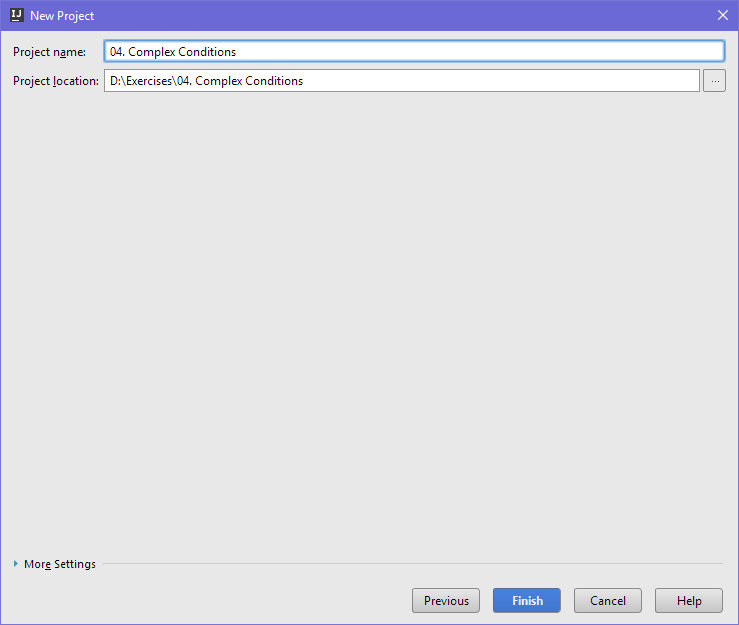

Сега имате създаден **празен IntelliJ проект** (с 0 пакета в него):

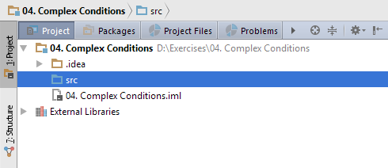

Целта на този **blank project** e да добавяте в него **по един пакет за всяка задача** от упражненията.

# 2. Обръщение според възраст и пол

Първата задача от тази тема е да се напише **конзолна програма**, която **прочита възраст** (десетично число) и **пол** ("**m**" или “**f**”), въведени от потребителя, и отпечатва **обръщение** измежду следните:

* „**Mr.**" – мъж (пол „**m**“) на 16 или повече години

* „**Master**" – момче (пол „**m**“) под 16 години

* „**Ms.**" – жена (пол „**f**“) на 16 или повече години

* „**Miss**" – момиче (пол „**f**“) под 16 години

Примери:

<table>
  <tr>
    <td>вход</td>
    <td>изход</td>
    <td></td>
    <td>вход</td>
    <td>изход</td>
    <td></td>
    <td>вход</td>
    <td>изход</td>
    <td></td>
    <td>вход</td>
    <td>изход</td>
  </tr>
  <tr>
    <td>12
f</td>
    <td>Miss</td>
    <td></td>
    <td>17
m</td>
    <td>Mr.</td>
    <td></td>
    <td>25
f</td>
    <td>Ms.</td>
    <td></td>
    <td>13.5
m</td>
    <td>Master</td>
  </tr>
</table>

1. Създайте **нов проект** в съществуващото IntelliJ решение. Кликнете с десен бутон на мишката върху **папката 'src'**. Изберете [New] → [Class]:

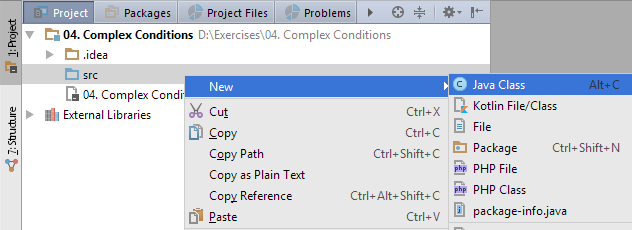 ➔ 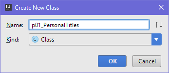

Вече имате проект с едно конзолно приложение в него. Остава да напишете кода за решаване на задачата.

2. Създайте main метод като отидете в тялото на класа „p01_PersonalTitles" (между квадратните скоби) и напишете:

<table>
  <tr>
    <td>public static void main(String[] args) {
}</td>
  </tr>
</table>

3. Отидете в тялото на метода **main(String[] args)** и напишете решението на задачата. Можете да си помогнете с кода от картинката по-долу:

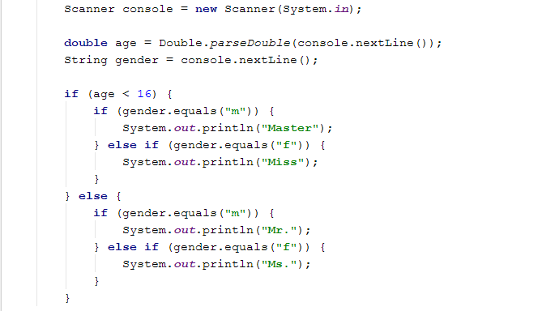

4. **Стартирайте** програмата с [Ctrl+Shift+F10] и я **тествайте** с различни входни стойности:

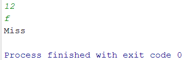    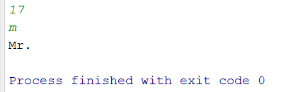

5. **Тествайте **решението си в** judge системата**: [https://judge.softuni.bg/Contests/Practice/Index/153#0](https://judge.softuni.bg/Contests/Practice/Index/153#0). Трябва да получите **100 точки** (напълно коректно решение):

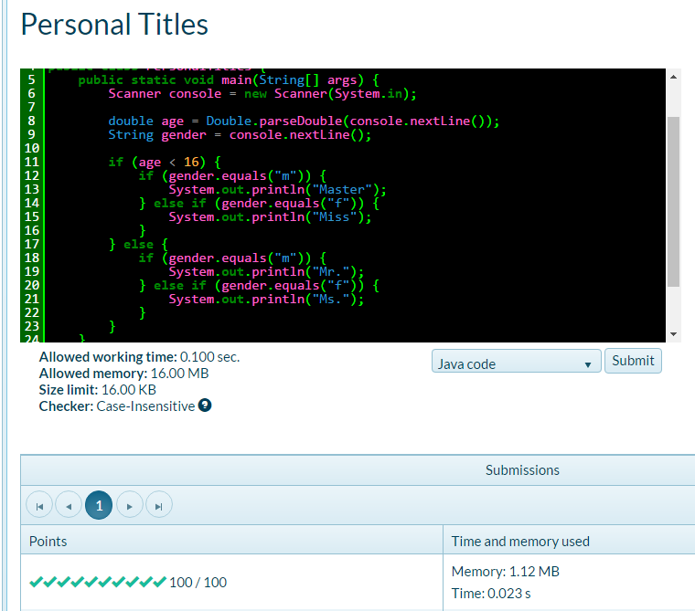

# 3. Квартално магазинче

Следващата задача има за цел да тренира работата с **вложени проверки** (nested **if**). Ето го и условието: предприемчив българин отваря **квартални магазинчета** в **няколко града** и продава на **различни цени**:

<table>
  <tr>
    <td>град / продукт</td>
    <td>coffee</td>
    <td>water</td>
    <td>beer</td>
    <td>sweets</td>
    <td>peanuts</td>
  </tr>
  <tr>
    <td>Sofia</td>
    <td>0.50</td>
    <td>0.80</td>
    <td>1.20</td>
    <td>1.45</td>
    <td>1.60</td>
  </tr>
  <tr>
    <td>Plovdiv</td>
    <td>0.40</td>
    <td>0.70</td>
    <td>1.15</td>
    <td>1.30</td>
    <td>1.50</td>
  </tr>
  <tr>
    <td>Varna</td>
    <td>0.45</td>
    <td>0.70</td>
    <td>1.10</td>
    <td>1.35</td>
    <td>1.55</td>
  </tr>
</table>

Напишете програма, която чете **град** (стринг), **продукт** (стринг) и **количество** (десетично число), въведени от потребителя, и пресмята и отпечатва **колко струва** съответното количество от избрания продукт в посочения град. Примери:

<table>
  <tr>
    <td>вход</td>
    <td>изход</td>
    <td></td>
    <td>вход</td>
    <td>изход</td>
    <td></td>
    <td>вход</td>
    <td>изход</td>
    <td></td>
    <td>вход</td>
    <td>изход</td>
    <td></td>
    <td>вход</td>
    <td>изход</td>
  </tr>
  <tr>
    <td>coffee
Varna
2</td>
    <td>0.9</td>
    <td></td>
    <td>peanuts
Plovdiv
1</td>
    <td>1.5</td>
    <td></td>
    <td>beer
Sofia
6</td>
    <td>7.2</td>
    <td></td>
    <td>water
Plovdiv
3</td>
    <td>2.1</td>
    <td></td>
    <td>sweets
Sofia
2.23</td>
    <td>3.2335</td>
  </tr>
</table>

1. Първо създайте **нова Java програма** в решението „**04. Complex Conditions**".

    * Кликнете с десен бутон върху папката „src" и изберете нов Java клас от [New] → [Java Class] с име „SmallShop“.

Вече имате ново конзолно приложение и остава да напишете кода за решаване на задачата.

1. Отидете в тялото на метода **main(String[] args)** и напишете решението на задачата. Можете да си помогнете с кода от картинката по-долу. Можете да прехвърлите всички букви в долен регистър с **.toLowerCase()** за да сравнявате продукти и градове без значение на малки / главни букви:

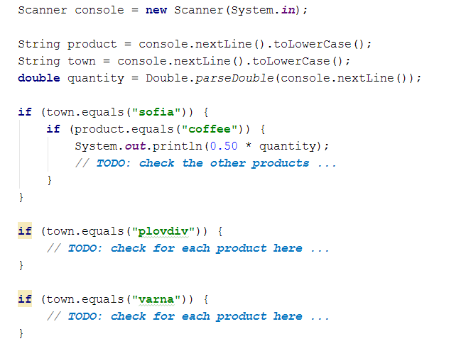

2. **Стартирайте** програмата с [Ctrl+Shift+F10] и я **тествайте** с различни входни стойности:

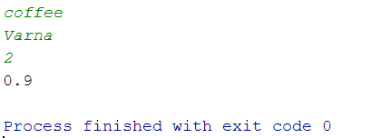    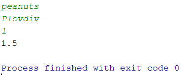

3. **Тествайте **решението си в** judge системата**: [https://judge.softuni.bg/Contests/Practice/Index/153#1](https://judge.softuni.bg/Contests/Practice/Index/153#1).

# 4. Точка в правоъгълник

Напишете програма, която проверява дали **точка {x, y}** се намира **вътре в правоъгълник {x1, y1} – {x2, y2}**. Входните данни се четат от конзолата и се състоят от 6 реда, въведени от потребителя: десетичните числа **x1**, **y1**, **x2**, **y2**, **x** и **y** (като се гарантира, че **x1 < x2** и **y1 < y2**). Една точка е вътрешна за даден правоъгълник, ако се намира някъде във вътрешността му или върху някоя от страните му. Отпечатайте „**Inside**" или „**Outside**“. Примери:

<table>
  <tr>
    <td>вход</td>
    <td>изход</td>
    <td>визуализация</td>
    <td></td>
    <td>вход</td>
    <td>изход</td>
    <td>визуализация</td>
  </tr>
  <tr>
    <td>2
-3
12
3
8
-1
</td>
    <td>Inside</td>
    <td></td>
    <td></td>
    <td>2
-3
12
3
11
-3.5
</td>
    <td>Outside</td>
    <td></td>
  </tr>
</table>

<table>
  <tr>
    <td>вход</td>
    <td>изход</td>
    <td>визуализация</td>
    <td></td>
    <td>вход</td>
    <td>изход</td>
    <td>визуализация</td>
  </tr>
  <tr>
    <td>-1
-3
4
1
0.5
1</td>
    <td>Inside</td>
    <td></td>
    <td></td>
    <td>-1
-3
4
1
-1.2
1.4</td>
    <td>Outside</td>
    <td></td>
  </tr>
</table>

**Тествайте **решението си в** judge системата**: [https://judge.softuni.bg/Contests/Practice/Index/153#2](https://judge.softuni.bg/Contests/Practice/Index/153#2).

* **Подсказка**: една точка е вътрешна за даден многоъгълник, ако едновременно са изпълнени следните четири условия (можете да ги проверите с **if** проверка с логическо „**и**" – оператор **&&**):

* Точката е надясно от лявата стена на правоъгълника (**x >= x1**)

* Точката е наляво от дясната стена на правоъгълника (**x <= x2**)

* Точката е надолу от горната стена на правоъгълника (**y >= y1**)

* Точката е нагоре от долната стена на правоъгълника (**y <= y2**)

# 5. Плод или зеленчук?

Да се напише програма, която **чете име на продукт**, въведено от потребителя, и проверява дали е **плод** или **зеленчук**.

* Плодовете "**fruit**" са **banana**, **apple**, **kiwi**, **cherry**, **lemon** и **grapes**

* Зеленчуците "**vegetable**" са **tomato**, **cucumber**, **pepper** и **carrot**

* Всички останали са "**unknown**"

Да се изведе „**fruit**", „**vegetable**“ или „**unknown**“ според въведения продукт. Примери:

<table>
  <tr>
    <td>вход</td>
    <td>изход</td>
    <td></td>
    <td>вход</td>
    <td>изход</td>
    <td></td>
    <td>вход</td>
    <td>изход</td>
    <td></td>
    <td>вход</td>
    <td>изход</td>
  </tr>
  <tr>
    <td>banana</td>
    <td>fruit</td>
    <td></td>
    <td>apple</td>
    <td>fruit</td>
    <td></td>
    <td>tomato</td>
    <td>vegetable</td>
    <td></td>
    <td>water</td>
    <td>unknown</td>
  </tr>
</table>

**Тествайте **решението си в** judge системата**: [https://judge.softuni.bg/Contests/Practice/Index/153#3](https://judge.softuni.bg/Contests/Practice/Index/153#3).

* **Подсказка**: използвайте условна **if** проверка с логическо „**или**" – operator **||**.

# 6. Невалидно число

Дадено **число е валидно**, ако е в диапазона [**100**…**200**] или е **0**. Да се напише програма, която **чете цяло число**, въведено от потребителя, и печата „**invalid**" ако въведеното число **не е валидно**. Примери:

<table>
  <tr>
    <td>вход</td>
    <td>изход</td>
    <td></td>
    <td>вход</td>
    <td>изход</td>
    <td></td>
    <td>вход</td>
    <td>изход</td>
    <td></td>
    <td>вход</td>
    <td>изход</td>
  </tr>
  <tr>
    <td>75</td>
    <td>invalid</td>
    <td></td>
    <td>150</td>
    <td>(няма изход)</td>
    <td></td>
    <td>220</td>
    <td>invalid</td>
    <td></td>
    <td>199</td>
    <td>(няма изход)</td>
  </tr>
</table>

<table>
  <tr>
    <td>вход</td>
    <td>изход</td>
    <td></td>
    <td>вход</td>
    <td>изход</td>
    <td></td>
    <td>вход</td>
    <td>изход</td>
    <td></td>
    <td>вход</td>
    <td>изход</td>
  </tr>
  <tr>
    <td>-1</td>
    <td>invalid</td>
    <td></td>
    <td>100</td>
    <td>(няма изход)</td>
    <td></td>
    <td>200</td>
    <td>(няма изход)</td>
    <td></td>
    <td>0</td>
    <td>(няма изход)</td>
  </tr>
</table>

**Тествайте **решението си в** judge системата**: [https://judge.softuni.bg/Contests/Practice/Index/153#4](https://judge.softuni.bg/Contests/Practice/Index/153#4).

* **Подсказка**: използвайте условна **if** проверка с **отрицание** и логически операции.

# 7. Точка върху страната на правоъгълник

Напишете програма, която проверява дали **точка {x, y}** се намира **върху някоя от страните на правоъгълник {x1, y1} – {x2, y2}**. Входните данни се четат от конзолата и се състоят от 6 реда, въведени от потребителя: десетичните числа **x1**, **y1**, **x2**, **y2**, **x** и **y** (като се гарантира, че **x1 < x2** и **y1 < y2**). Да се отпечата „**Border**" (точката лежи на някоя от страните) или „**Inside / Outside**“ (в противен случай). Примери:

<table>
  <tr>
    <td>вход</td>
    <td>изход</td>
    <td>визуализация</td>
    <td></td>
    <td>вход</td>
    <td>изход</td>
    <td>визуализация</td>
  </tr>
  <tr>
    <td>2
-3
12
3
8
-1
</td>
    <td>Inside / Outside</td>
    <td></td>
    <td></td>
    <td>2
-3
12
3
12
-1
</td>
    <td>Border</td>
    <td></td>
  </tr>
</table>

**Тествайте **решението си в** judge системата**: [https://judge.softuni.bg/Contests/Practice/Index/153#5](https://judge.softuni.bg/Contests/Practice/Index/153#5).

* **Подсказка**: използвайте една или няколко условни **if** проверки с логически операции. Точка **{x, y} **лежи върху някоя от страните на правоъгълник **{x1, y1} – {x2, y2}**, ако е изпълнено едно от следните условия:

* **x** съвпада с **x1** или **x2** и същевременно **y** е между **y1** и **y2**

* **y** съвпада с **y1** или **y2** и същевременно **x** е между **x1** и **x2**

Можете да проверите горните условия с една по-сложна **if**-**else** конструкция или с няколко по-прости проверки или с **вложени** **if**-**else** проверки.

# 8. Магазин за плодове

Магазин за плодове през **работните дни** работи на следните **цени**:

<table>
  <tr>
    <td>плод</td>
    <td>banana</td>
    <td>apple</td>
    <td>orange</td>
    <td>grapefruit</td>
    <td>kiwi</td>
    <td>pineapple</td>
    <td>grapes</td>
  </tr>
  <tr>
    <td>цена</td>
    <td>2.50</td>
    <td>1.20</td>
    <td>0.85</td>
    <td>1.45</td>
    <td>2.70</td>
    <td>5.50</td>
    <td>3.85</td>
  </tr>
</table>

**Събота** и **неделя** магазинът работи на **по-високи** **цени**:

<table>
  <tr>
    <td>плод</td>
    <td>banana</td>
    <td>apple</td>
    <td>orange</td>
    <td>grapefruit</td>
    <td>kiwi</td>
    <td>pineapple</td>
    <td>grapes</td>
  </tr>
  <tr>
    <td>цена</td>
    <td>2.70</td>
    <td>1.25</td>
    <td>0.90</td>
    <td>1.60</td>
    <td>3.00</td>
    <td>5.60</td>
    <td>4.20</td>
  </tr>
</table>

Напишете програма, която чете от конзолата **плод** (banana / apple / orange / grapefruit / kiwi / pineapple / grapes), **ден от седмицата** (Monday / Tuesday / Wednesday / Thursday / Friday / Saturday / Sunday) и** количество** (десетично число) , въведени от потребителя, и пресмята **цената** според цените от таблиците по-горе. При невалиден ден от седмицата или невалидно име на плод да се отпечата „**error**". Примери:

<table>
  <tr>
    <td>вход</td>
    <td>изход</td>
    <td></td>
    <td>вход</td>
    <td>изход</td>
    <td></td>
    <td>вход</td>
    <td>изход</td>
    <td></td>
    <td>вход</td>
    <td>изход</td>
    <td></td>
    <td>вход</td>
    <td>изход</td>
  </tr>
  <tr>
    <td>apple
Tuesday
2</td>
    <td>2.40</td>
    <td></td>
    <td>orange
Sunday
3</td>
    <td>2.70</td>
    <td></td>
    <td>kiwi
Monday
2.5</td>
    <td>6.75</td>
    <td></td>
    <td>grapes
Saturday
0.5</td>
    <td>2.10</td>
    <td></td>
    <td>tomato
Monday
0.5</td>
    <td>error</td>
  </tr>
</table>

**Тествайте **решението си в** judge системата**: [https://judge.softuni.bg/Contests/Practice/Index/153#6](https://judge.softuni.bg/Contests/Practice/Index/153#6).

* **Подсказки**:

* Прочетете входа и обърнете името на плода и деня от седмицата в **малки букви**:

* Първоначално задайте цена **-1**:

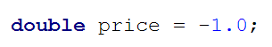

* Използвайте вложени **if** проверки, за да изчислите цената за дадения плод и ден от седмицата:

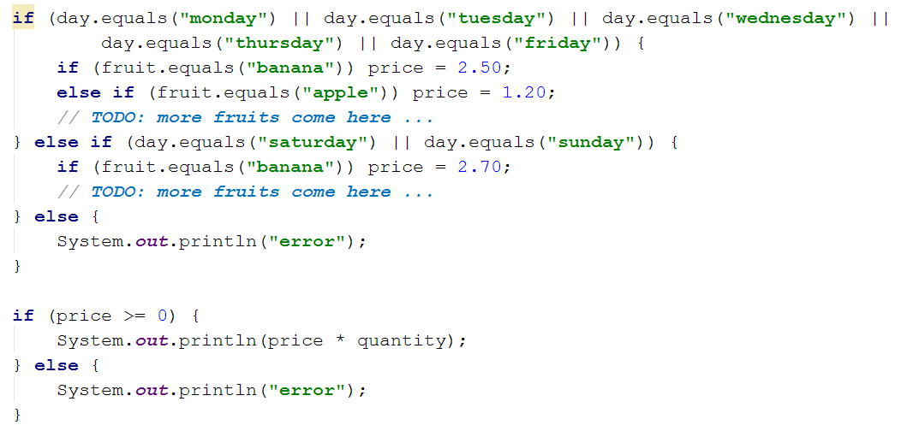

* Накрая проверете цената. Ако все още е **-1**, значи даденият плод или денят от седмицата е **невалиден**. 

# 9. Търговски комисионни

Фирма дава следните **комисионни** на търговците си според **града**, в който работят и обема на **продажбите** **s**:

<table>
  <tr>
    <td>Град</td>
    <td>0 ≤ s ≤ 500</td>
    <td>500 < s ≤ 1 000</td>
    <td>1 000 < s ≤ 10 000</td>
    <td>s > 10 000</td>
  </tr>
  <tr>
    <td>Sofia</td>
    <td>5%</td>
    <td>7%</td>
    <td>8%</td>
    <td>12%</td>
  </tr>
  <tr>
    <td>Varna</td>
    <td>4.5%</td>
    <td>7.5%</td>
    <td>10%</td>
    <td>13%</td>
  </tr>
  <tr>
    <td>Plovdiv</td>
    <td>5.5%</td>
    <td>8%</td>
    <td>12%</td>
    <td>14.5%</td>
  </tr>
</table>

Напишете **конзолна програма**, която чете име на **град** (стринг) и обем на **продажби** (десетично число) , въведени от потребителя, и изчислява и извежда размера на търговската **комисионна** според горната таблица. Резултатът да се изведе закръглен с **2 цифри след десетичната точка**. При **невалиден** град или обем на продажбите (отрицателно число) да се отпечата „**error**". Примери:

<table>
  <tr>
    <td>вход</td>
    <td>изход</td>
    <td></td>
    <td>вход</td>
    <td>изход</td>
    <td></td>
    <td>вход</td>
    <td>изход</td>
    <td></td>
    <td>вход</td>
    <td>изход</td>
  </tr>
  <tr>
    <td>Sofia
1500</td>
    <td>120.00</td>
    <td></td>
    <td>Plovdiv
499.99</td>
    <td>27.50</td>
    <td></td>
    <td>Varna
3874.50</td>
    <td>387.45</td>
    <td></td>
    <td>Kaspichan
-50</td>
    <td>error</td>
  </tr>
</table>

**Тествайте **решението си в** judge системата**: [https://judge.softuni.bg/Contests/Practice/Index/153#7](https://judge.softuni.bg/Contests/Practice/Index/153#7).

* **Подсказки**:

* Прочетете входа и **обърнете града в** **малки букви** (като в предходната задача).

* Първоначално задайте **комисионна -1**. Тя ще бъде променена, ако градът и ценовият диапазон бъдат намерени в таблицата с комисионните.

* Използвайте вложени **if** проверки, за **да изчислите комисионната** според града и според обема на продажбите. Може да си помогнете с кода по-долу:

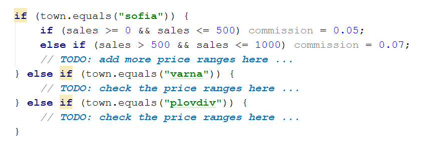

* Накрая проверете комисионната. Ако все още е **-1**, значи въведеният град или обем продажби не се срещат в таблицата с комисионните и трябва да се отпечата „**error**". В противен случай трябва да се изчисли комисионната (процент комисионна по обем на продажбите) и да се отпечата със закръгляне с точно **2 цифри след десетичната точка**. Може да използвате **System.out.printf("%.2f", commission);**

# 10. Ден на седмицата

Принтирайте името на деня на седмицата по номер на деня от (на английаки) [1...7] или принтирайте "**Error**" за невалидно число.

### Примери

<table>
  <tr>
    <td>Input</td>
    <td>Output</td>
  </tr>
  <tr>
    <td>1</td>
    <td>Monday</td>
  </tr>
  <tr>
    <td>2</td>
    <td>Tuesday</td>
  </tr>
  <tr>
    <td>3</td>
    <td>Wednesday</td>
  </tr>
  <tr>
    <td>4</td>
    <td>Thursday</td>
  </tr>
  <tr>
    <td>5</td>
    <td>Friday</td>
  </tr>
  <tr>
    <td>6</td>
    <td>Saturday</td>
  </tr>
  <tr>
    <td>7</td>
    <td>Sunday</td>
  </tr>
  <tr>
    <td>-1</td>
    <td>Error</td>
  </tr>
</table>

### Съвети

Ползвайте **switch-case** конструкция.

# 11. Клас животно

Напишете програма която принтира класа на животното според името му, въведено от потребителя:

* **dog -> mammal**

* **crocodile, tortoise, snake -> reptile**

* **others -> unknown**

### Примери

<table>
  <tr>
    <td>Input</td>
    <td>Output</td>
  </tr>
  <tr>
    <td>dog</td>
    <td>mammal</td>
  </tr>
  <tr>
    <td>snake</td>
    <td>reptile</td>
  </tr>
  <tr>
    <td>cat</td>
    <td>unknown</td>
  </tr>
</table>

### Съвети

Ползвайте **switch-case** конструкция.

# 12. Кино

В една кинозала столовете са наредени в правоъгълна форма в **r** реда и **c** колони. Има три вида прожекции с билети на различни цени:

* **Premiere** – премиерна прожекция, на цена **12.00** лева.

* **Normal** – стандартна прожекция, на цена **7.50** лева.

* **Discount** – прожекция за деца, ученици и студенти на намалена цена от **5.00** лева.

Напишете програма, която чете **тип прожекция** (стринг), брой **редове **и брой **колони** в залата (цели числа), въведени от потребителя, и изчислява общите приходи от билети при пълна зала. Резултатът да се отпечата във формат като в примерите по-долу, с 2 знака след десетичната точка.  Примери:

<table>
  <tr>
    <td>вход</td>
    <td>изход</td>
    <td></td>
    <td>вход</td>
    <td>изход</td>
    <td></td>
    <td>вход</td>
    <td>изход</td>
  </tr>
  <tr>
    <td>Premiere
10
12</td>
    <td>1440.00 leva</td>
    <td></td>
    <td>Normal
21
13</td>
    <td>2047.50 leva</td>
    <td></td>
    <td>Discount
12
30</td>
    <td>1800.00 leva</td>
  </tr>
</table>

**Тествайте **решението си в** judge системата**: [https://judge.softuni.bg/Contests/Practice/Index/153#8](https://judge.softuni.bg/Contests/Practice/Index/153#8).

* **Подсказка**: използвайте прости проверки и елементарни изчисления. За да изведете резултата с точно 2 цифри след десетичната точка, използвайте **System.out.printf("%.2f",** **result)**.

# 13. Волейбол

Влади е студент, живее в София и си ходи от време на време до родния град. Той е много запален по волейбола, но е зает през работните дни и играе **волейбол** само през **уикендите** и в **празничните дни**. Влади играе **в София** всяка **събота**, когато **не е на работа** и **не си пътува до родния град**, както и в **2/3 от празничните дни**. Той пътува до **родния си град** **h**** пъти **в годината, където играе волейбол със старите си приятели в **неделя**. Влади** не е на работа 3/4 от уикендите**, в които е в София.** **Отделно, през **високосните години** Влади играе с **15% повече** волейбол от нормалното. Приемаме, че годината има точно **48 уикенда**, подходящи за волейбол.

Напишете програма, която изчислява **колко пъти Влади е играл волейбол** през годината. **Закръглете резултата **надолу до най-близкото цяло число (например 2.15 → 2; 9.95 → 9).

Входните данни се въвеждат от потребителя, в следния вид: 

* Първият ред съдържа думата „**leap**" (високосна година) или „**normal**“ (невисокосна).

* Вторият ред съдържа цялото число **p** – брой празници в годината (които не са събота и неделя).

* Третият ред съдържа цялото число **h** – брой уикенди, в които Влади си пътува до родния град.

Примери:

<table>
  <tr>
    <td>вход</td>
    <td>изход</td>
    <td>Коментари</td>
  </tr>
  <tr>
    <td>leap
5
2</td>
    <td>45</td>
    <td>48 уикенда в годината, разделени по следния начин:
46 уикенда в София → 46 * 3 / 4 → 34.5 съботни игри в София
2 уикенда в родния си град → 2 недели → 2 игри в неделя в родния град
5 празника:
5 * 2/3 → 3.333 игри в София в празничен ден
Общо игри през уикенди и празници в София и в родния град: 34.5 + 2 + 3.333 → 39.833
Годината е високосна:
Влади играе допълнителни 15% * 39.833 → 5.975 игри волейбол
Общо игри през цялата година:
39.833 + 5.975 = 45.808 игри
Резултатът е 45 (закръгля се надолу)</td>
  </tr>
</table>

<table>
  <tr>
    <td>вход</td>
    <td>изход</td>
    <td></td>
    <td>вход</td>
    <td>изход</td>
    <td></td>
    <td>вход</td>
    <td>изход</td>
    <td></td>
    <td>вход</td>
    <td>изход</td>
    <td></td>
    <td>вход</td>
    <td>изход</td>
  </tr>
  <tr>
    <td>normal
3
2</td>
    <td>38</td>
    <td></td>
    <td>leap
2
3</td>
    <td>43</td>
    <td></td>
    <td>normal
11
6</td>
    <td>44</td>
    <td></td>
    <td>leap
0
1</td>
    <td>41</td>
    <td></td>
    <td>normal
6
13</td>
    <td>43</td>
  </tr>
</table>

**Тествайте **решението си в** judge системата**: [https://judge.softuni.bg/Contests/Practice/Index/153#9](https://judge.softuni.bg/Contests/Practice/Index/153#9).

* **Подсказки**:

* Пресметнете **уикендите в София** (48 минус уикендите в родния град). Пресметнете **броя игри в уикендите в София**: умножете уикендите в София с (3.0 / 4). Обърнете внимание, че трябва да се използва **дробно деление** (3.0 / 4), а не целочислено (3 / 4).

* Пресметнете **броя игри в родния град**. Те са точно колкото са пътуванията до родния град.

* Пресметнете **броя игри в празничен ден**. Те са броя празници умножени по (2.0 / 3).

* **Сумирайте** броя на всички игри. Той е дробно число. Не бързайте да закръгляте още.

* Ако годината е **високосна**, добавете **15%** към общия брой игри.

* Накрая **закръглете** надолу до най-близкото цяло число с **Math.floor(result)**.

# 14. * Точка във фигурата

**Фигура** се състои от **6 блокчета** **с размер** **h * h**, разположени като на фигурата вдясно. Долният ляв ъгъл на сградата е на позиция {0, 0}. Горният десен ъгъл на фигурата е на позиция {**2*h**, **4*h**}. На фигурата координатите са дадени при **h = 2**.

Напишете програма, която чете цяло число **h** и координатите на дадена **точка** {**x**, **y**} (цели числа), въведени от потребителя, и отпечатва дали точката е вътре във фигурата (**inside**), вън от фигурата (**outside**) или на някоя от стените на фигурата (**border**).

Примери:

<table>
  <tr>
    <td>вход</td>
    <td>изход</td>
    <td>визуализация</td>
    <td></td>
    <td>вход</td>
    <td>изход</td>
    <td>визуализация</td>
  </tr>
  <tr>
    <td>2
3
10</td>
    <td>outside</td>
    <td></td>
    <td></td>
    <td>15
13
55</td>
    <td>outside</td>
    <td></td>
  </tr>
  <tr>
    <td>2
3
1</td>
    <td>inside</td>
    <td></td>
    <td>
</td>
    <td>15
29
37</td>
    <td>inside</td>
    <td></td>
  </tr>
  <tr>
    <td>2
2
2</td>
    <td>border</td>
    <td></td>
    <td>
</td>
    <td>15
37
18</td>
    <td>outside</td>
    <td></td>
  </tr>
  <tr>
    <td>2
6
0</td>
    <td>border</td>
    <td></td>
    <td>
</td>
    <td>15
-4
7</td>
    <td>outside</td>
    <td></td>
  </tr>
  <tr>
    <td>2
0
6</td>
    <td>outside</td>
    <td></td>
    <td>
</td>
    <td>15
30
0</td>
    <td>border</td>
    <td></td>
  </tr>
</table>

**Тествайте **решението си в** judge системата**: [https://judge.softuni.bg/Contests/Practice/Index/153#10](https://judge.softuni.bg/Contests/Practice/Index/153#10).

* **Подсказки**:

* Може да разделите фигурата на **два правоъгълника** с обща стена.

* Една точка е **външна** (**outside**) за фигурата, когато е едновременно **извън** двата правоъгълника.

* Една точка е **вътрешна** (**inside**) за фигурата, ако е вътре в някой от правоъгълниците (изключвайки стените им) или лежи върху общата им стена.

* В **противен случай** точката лежи на стената на правоъгълника (**border**).

