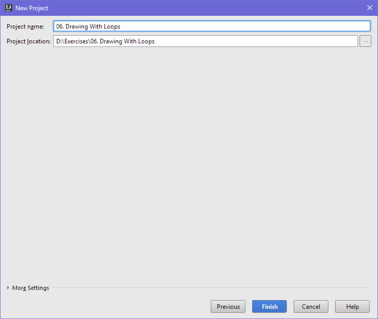
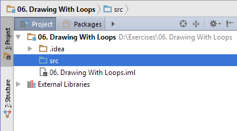
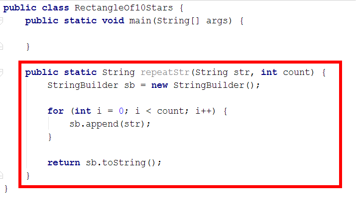
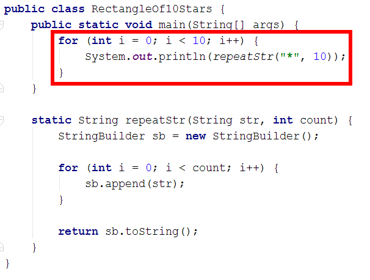
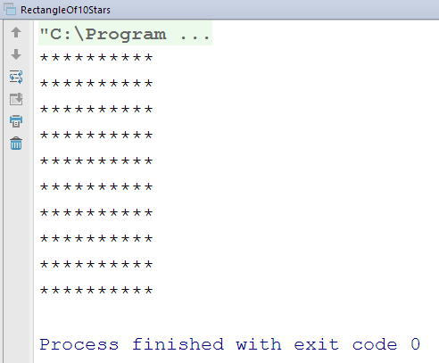
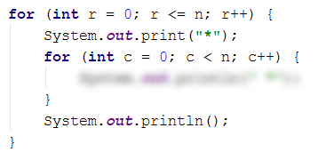

# Упражнения: Чертане с цикли

Задачи за упражнение в клас и за домашно към курса [„Основи на програмирането" @ СофтУни](https://softuni.bg/courses/programming-basics).

# 1. Празно IntelliJ решение (Blank Project)

Създайте празно решение (Blank Project) във IntelliJ. Класовете в IntelliJ обединяват група проекти. Тази възможност е изключително удобна, когато искаме да работим по няколко проекта и бързо да превключваме между тях или искаме да обединим логически няколко взаимосвързани проекта.

В настоящото практическо занимание ще използваме Java проект и няколко класа, за да ор**г**анизираме решенията на задачите от упражненията – всяка задача в отделен клас в общ проект.

1. Стартирайте IntelliJ IDEA.

2. Създайте нов проект: [Create New Project].

3. Изберете от диалоговия прозорец [Java] → [Next] → [Next] и дайте подходящо име на проекта, например „**Drawing With Loops**":

➔

Сега имате създаден **празен IntelliJ проект** (с 0 пакета в него):

Целта на този **blank project** e да добавяте в него **по един пакет за всяка задача** от упражненията.

# 2. Правоъгълник от 10 x 10 звездички

Напишете програма, която чертае на конзолата **правоъгълник от 10 x 10 звездички**:

<table>
  <tr>
    <td>вход</td>
    <td>изход</td>
  </tr>
  <tr>
    <td>(няма)</td>
    <td>**********
**********
**********
**********
**********
**********
**********
**********
**********
**********</td>
  </tr>
</table>

**Подсказки**:

1. Създайте **нов проект** в съществуващото IntelliJ решение – конзолна Java програма. Задайте подходящо име на проекта, например "**Rectangle-of-10x10-Stars**".

2. За да може да повтаряте знаци лесно си направете метод „**repeatStr**", който приема като параметри **знакът, който ще се повтаря** и **колко пъти**:

3. Отидете в тялото на метода **main(String[]** **args)** и напишете решението на задачата. Можете да си помогнете с кода от картинката по-долу:

4. **Стартирайте** програмата с [Ctrl+Shift+F10] и я **тествайте**:

   

5. **Тествайте **решението си в** judge системата**: [https://judge.softuni.bg/Contests/Practice/Index/155#0](https://judge.softuni.bg/Contests/Practice/Index/155#0). Трябва да получите **100 точки** (напълно коректно решение).

# 3. Правоъгълник от N x N звездички

Напишете програма, която чете цяло положително число **n**, въведено от потребителя, и печата на конзолата **правоъгълник от ****n**** * ****n**** звездички**. Примери:

<table>
  <tr>
    <td>вход</td>
    <td>изход</td>
    <td></td>
    <td>вход</td>
    <td>изход</td>
    <td></td>
    <td>вход</td>
    <td>изход</td>
  </tr>
  <tr>
    <td>2</td>
    <td>**
**</td>
    <td></td>
    <td>3</td>
    <td>***
***
***</td>
    <td></td>
    <td>4</td>
    <td>****
****
****
****</td>
  </tr>
</table>

**Тествайте **решението си в** judge системата**: [https://judge.softuni.bg/Contests/Practice/Index/155#1](https://judge.softuni.bg/Contests/Practice/Index/155#1).

**Подсказка**: отпечатайте **n** звездички в цикъл **n** пъти, точно както в предната задача.

# 4. Квадрат от звездички

Напишете програма, която чете число **n**, въведено от потребителя, и чертае **квадрат от ****n**** * ****n**** звездички**. Разликата с предходната задача е, че между всеки две звездички има по един интервал. Примери:

<table>
  <tr>
    <td>вход</td>
    <td>изход</td>
    <td></td>
    <td>вход</td>
    <td>изход</td>
    <td></td>
    <td>вход</td>
    <td>изход</td>
  </tr>
  <tr>
    <td>2</td>
    <td>* *
* *</td>
    <td></td>
    <td>3</td>
    <td>* * *
* * *
* * *</td>
    <td></td>
    <td>4</td>
    <td>* * * *
* * * *
* * * *
* * * *</td>
  </tr>
</table>

**Тествайте **решението си в** judge системата**: [https://judge.softuni.bg/Contests/Practice/Index/155#2](https://judge.softuni.bg/Contests/Practice/Index/155#2).

**Подсказка**: завъртете два вложени цикъла. Може да си помогнете с кода по-долу (част от кода е нарочно замъглен, за да не преписвате механично, а да се замислите малко):

# 5. Триъгълник от долари

Да се напише програма, която чете число **n**, въведено от потребителя, и печата **триъгълник от долари** като в примерите:

<table>
  <tr>
    <td>вход</td>
    <td>изход</td>
    <td></td>
    <td>вход</td>
    <td>изход</td>
    <td></td>
    <td>вход</td>
    <td>изход</td>
    <td></td>
    <td>вход</td>
    <td>изход</td>
  </tr>
  <tr>
    <td>2</td>
    <td>$
$ $</td>
    <td></td>
    <td>3</td>
    <td>$
$ $
$ $ $</td>
    <td></td>
    <td>4</td>
    <td>$
$ $
$ $ $
$ $ $ $</td>
    <td></td>
    <td>5</td>
    <td>$
$ $
$ $ $
$ $ $ $
$ $ $ $ $</td>
  </tr>
</table>

**Тествайте **решението си в** judge системата**: [https://judge.softuni.bg/Contests/Practice/Index/155#3](https://judge.softuni.bg/Contests/Practice/Index/155#3).

**Подсказка**: завъртете два вложени цикъла: за първия **row** = **1** … **n**; за втория **col** = **1** … **row**.

# 6. Квадратна рамка

Напишете програма, която чете цяло положително число **n**, въведено от потребителя,** **и чертае на конзолата **квадратна рамка** с размер **n** * **n** като в примерите по-долу:

<table>
  <tr>
    <td>вход</td>
    <td>изход</td>
    <td></td>
    <td>вход</td>
    <td>изход</td>
    <td></td>
    <td>вход</td>
    <td>изход</td>
    <td></td>
    <td>вход</td>
    <td>изход</td>
  </tr>
  <tr>
    <td>3</td>
    <td>+ - +
| - |
+ - +</td>
    <td></td>
    <td>4</td>
    <td>+ - - +
| - - |
| - - |
+ - - +</td>
    <td></td>
    <td>5</td>
    <td>+ - - - +
| - - - |
| - - - |
| - - - |
+ - - - +
</td>
    <td></td>
    <td>6</td>
    <td>+ - - - - +
| - - - - |
| - - - - |
| - - - - |
| - - - - |
+ - - - - +</td>
  </tr>
</table>

**Тествайте **решението си в** judge системата**: [https://judge.softuni.bg/Contests/Practice/Index/155#4](https://judge.softuni.bg/Contests/Practice/Index/155#4).

**Подсказки**:

* Отпечатайте горната част: знак "**+**", n-2 пъти знак “**-**”, знак “**+**”.

* Отпечатайте средната част: в цикъл n-2 пъти печатайте знак "**|**", n-2 пъти знак “**-**”, знак “**|**”.

* Отпечатайте долната част: знак "**+**", n-2 пъти знак “**-**”, знак “**+**”.

# 7. Ромбче от звездички

Напишете програма, която чете цяло положително число **n**, въведено от потребителя, и печата **ромбче от звездички** с размер **n** като в примерите по-долу:

<table>
  <tr>
    <td>вход</td>
    <td>изход</td>
    <td></td>
    <td>вход</td>
    <td>изход</td>
    <td></td>
    <td>вход</td>
    <td>изход</td>
    <td></td>
    <td>вход</td>
    <td>изход</td>
  </tr>
  <tr>
    <td>1</td>
    <td>*</td>
    <td></td>
    <td>2</td>
    <td> *
* *
 *</td>
    <td></td>
    <td>3</td>
    <td>  *
 * *
* * *
 * *
  *</td>
    <td></td>
    <td>4</td>
    <td>   *
  * *
 * * *
* * * *
 * * *
  * *
   *</td>
  </tr>
</table>

**Тествайте **решението си в** judge системата**: [https://judge.softuni.bg/Contests/Practice/Index/155#5](https://judge.softuni.bg/Contests/Practice/Index/155#5).

**Подсказки**:

* Разделете ромба на горна и долна част и ги печатайте с два отделни цикъла.

* За **горната част** завъртете цикъл за **row** от **1** то **n**:

    * Отпечатайте **n-row** интервала.

    * Отпечатайте "*****".

    * Отпечатайте **row-1** пъти "** ***".

* **Долната част** отпечатайте аналогично на горната с цикъл от **1** до **n-1**.

# 8. Коледна елха

Напишете програма, която чете число **n** (1 ≤ **n** ≤ 100), въведено от потребителя, и печата **коледна елха** с размер **n** като в примерите по-долу:

<table>
  <tr>
    <td>вход</td>
    <td>изход</td>
    <td></td>
    <td>вход</td>
    <td>изход</td>
    <td></td>
    <td>вход</td>
    <td>изход</td>
    <td></td>
    <td>вход</td>
    <td>изход</td>
  </tr>
  <tr>
    <td>1</td>
    <td>  |
* | *</td>
    <td></td>
    <td>2</td>
    <td>   |
 * | *
** | **</td>
    <td></td>
    <td>3</td>
    <td>    |
  * | *
 ** | **
*** | ***</td>
    <td></td>
    <td>4</td>
    <td>     |
   * | *
  ** | **
 *** | ***
**** | ****</td>
  </tr>
</table>

**Тествайте **решението си в** judge системата**: [https://judge.softuni.bg/Contests/Practice/Index/155#6](https://judge.softuni.bg/Contests/Practice/Index/155#6).

**Подсказки**: 

* В цикъл за **i** от **0** до **n** печатайте (за лявата част на елхата):

    * **n-i** интервала; **n** звездички; вертикална черта.

* Аналогично довършете дясната част на елхата.

# 9. Слънчеви очила

Напишете програма, която чете цяло число **n** (3 ≤ **n** ≤ 100), въведено от потребителя, и печата **слънчеви очила** с размер **5*n** x **n** като в примерите:

<table>
  <tr>
    <td>вход</td>
    <td>изход</td>
  </tr>
  <tr>
    <td>3</td>
    <td>******   ******
*////*|||*////*
******   ******</td>
  </tr>
  <tr>
    <td>4</td>
    <td>********    ********
*//////*||||*//////*
*//////*    *//////*
********    ********</td>
  </tr>
  <tr>
    <td>5</td>
    <td>**********     **********
*////////*     *////////*
*////////*|||||*////////*
*////////*     *////////*
**********     **********</td>
  </tr>
</table>

**Тествайте **решението си в** judge системата**: [https://judge.softuni.bg/Contests/Practice/Index/155#7](https://judge.softuni.bg/Contests/Practice/Index/155#7).

**Подсказки**:

* Отпечатайте **най-горния ред **от очилата:

    * **2*n** звездички; **n** интервала; **2*n** звездички

* Отпечатайте **средните** **n-2** **реда**:

    * звездичка; **2*n-2** наклонени черти; звездичка; **n** интервала; звездичка; **2*n-2** наклонени черти; звездичка

    * когато редът е **(n-1)** **/** **2** **-** **1**, печатайте **n** вертикални черти вместо **n** интервала

* Отпечатайте **най-долния ред **от очилата:

    * **2*n** звездички; **n** интервала; **2*n** звездички

# 10. Къщичка

Напишете програма, която чете число **n** (2 ≤ **n** ≤ 100), въведено от потребителя, и печата **къщичка** с размер **n** x **n**:

<table>
  <tr>
    <td>вход</td>
    <td>изход</td>
    <td></td>
    <td>вход</td>
    <td>изход</td>
    <td></td>
    <td>вход</td>
    <td>изход</td>
    <td></td>
    <td>вход</td>
    <td>изход</td>
    <td></td>
    <td>вход</td>
    <td>изход</td>
  </tr>
  <tr>
    <td>2</td>
    <td>**
||</td>
    <td></td>
    <td>3</td>
    <td>-*-
***
|*|</td>
    <td></td>
    <td>4</td>
    <td>-**-
****
|**|
|**|</td>
    <td></td>
    <td>5</td>
    <td>--*--
-***-
*****
|***|
|***|</td>
    <td></td>
    <td>6</td>
    <td>--**--
-****-
******
|****|
|****|
|****|</td>
  </tr>
</table>

**Тествайте **решението си в** judge системата**: [https://judge.softuni.bg/Contests/Practice/Index/155#8](https://judge.softuni.bg/Contests/Practice/Index/155#8).

**Подсказки**:

* Отпечатайте в цикъл **покрива** на къщичката:

    * Той съдържа **(n** **+** **1)** **/** **2** реда.

    * На първия си ред съдържа **1** звездичка при нечетно **n** или **2** звездички при четно **n**.

    * На всеки следващ ред съдържа с **2** звездички повече.

* Отпечатайте в цикъл основата на къщичката: **n** **/** **2** **-** **1** реда.

# 11. * Диамант

Напишете програма, която чете цяло число **n** (1 ≤ **n** ≤ 100), въведено от потребителя, и печата диамант с размер **n** като в примерите по-долу:

<table>
  <tr>
    <td>вход</td>
    <td>изход</td>
    <td></td>
    <td>вход</td>
    <td>изход</td>
    <td></td>
    <td>вход</td>
    <td>изход</td>
    <td></td>
    <td>вход</td>
    <td>изход</td>
    <td></td>
    <td>вход</td>
    <td>изход</td>
  </tr>
  <tr>
    <td>1</td>
    <td>*</td>
    <td></td>
    <td>2</td>
    <td>**</td>
    <td></td>
    <td>3</td>
    <td>-*-
*-*
-*-</td>
    <td></td>
    <td>4</td>
    <td>-**-
*--*
-**-</td>
    <td></td>
    <td>5</td>
    <td>--*--
-*-*-
*---*
-*-*-
--*--</td>
  </tr>
</table>

<table>
  <tr>
    <td>вход</td>
    <td>изход</td>
    <td></td>
    <td>вход</td>
    <td>изход</td>
    <td></td>
    <td>вход</td>
    <td>изход</td>
    <td></td>
    <td>вход</td>
    <td>изход</td>
  </tr>
  <tr>
    <td>6</td>
    <td>--**--
-*--*-
*----*
-*--*-
--**--</td>
    <td></td>
    <td>7</td>
    <td>---*---
--*-*--
-*---*-
*-----*
-*---*-
--*-*--
---*---</td>
    <td></td>
    <td>8</td>
    <td>---**---
--*--*--
-*----*-
*------*
-*----*-
--*--*--
---**---</td>
    <td></td>
    <td>9</td>
    <td>----*----
---*-*---
--*---*--
-*-----*-
*-------*
-*-----*-
--*---*--
---*-*---
----*----</td>
  </tr>
</table>

**Тествайте **решението си в** judge системата**: [https://judge.softuni.bg/Contests/Practice/Index/155#9](https://judge.softuni.bg/Contests/Practice/Index/155#9).

**Подсказки**:

* Всички редове съдържат точно по **n** символа.

* Първият ред съдържа **отляво и отдясно** точно **leftRight** = **(****n**** - 1) / 2** тирета.

* Всеки следващ ред **до средния** съдържа отляво и отдясно с **1 тире по-малко** от предходния.

* Всеки следващ ред **след средния** съдържа отляво и отдясно с **1 тире повече** от предходния.

* Всеки ред съдържа **в средата **си (във вътрешността на диаманта)** ****mid**** **= **n**** - 2 * ****leftRight**** - 2** тирета.

* Всеки ред съдържа **2 звездички**, освен когато **mid** е отрицателно (тогава има само 1 звездичка).

* За всеки ред може да се изчислят и отпечатат неговите 5 съставни части:

    * **leftRight** тиренца отляво

    * **1** звездичка

    * **mid** тиренца в средата (когато **mid** >= **0**)

    * **1** звездичка (когато **mid** >= **0**)

    * **1** звездичка

    * **leftRight** тиренца отляво

