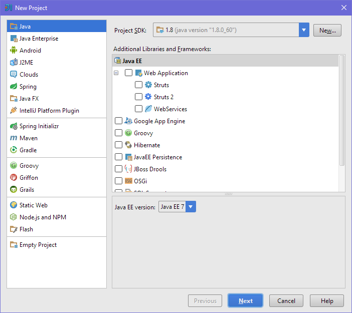

# Упражнения: Прости пресмятания

Задачи за упражнение в клас и за домашно към курса [„Основи на програмирането" @ СофтУни](https://softuni.bg/courses/programming-basics).

1. Празно IntelliJ решение (Blank Project)

Създайте празно решение (**Blank Project**) във IntelliJ. Класовете във Java ни позволяват да сложим няколко решения в един и същи проект. Тази възможност е изключително удобна когато искаме да работим по няколко проекта и бързо да превключваме между тях или искаме да обединим логически няколко взаимосвързани проекта.

В настоящото практическо занимание ще използваме **празен проект и няколко класа** за да организираме решенията на задачите от упражненията – всяка задача в отделен клас и всички класове в общ проект.

1. Стартирайте IntelliJ IDEA.

2. Създайте нов** проект**: [Create New Project].

3. Изберете от диалоговия прозорец [Java] → [Next] → [Next] и дайте подходящо име на проекта, например "**Simple Calculations**":

 →

Сега имате създаден **празен IntelliJ проект** (с 0 класа в него):

Целта на този blank project e да добавяте в него **по един клас за всяка задача** от упражненията.

2. Пресмятане на лице на квадрат

Първата задача от тази тема е следната: да се напише **конзолна програма**, която **прочита цяло число** **a**, въведено от потребителя, и **пресмята лицето на квадрат** **със страна** **a**. Задачата е тривиално лесна: въвеждате число от конзолата, умножавате го само по себе си и печатате получения резултат на конзолата.

1. Създайте **нов проект** в съществуващото IntelliJ решение. В Project Explorer кликнете с десен бутон на мишката върху „**src" папката**. Изберете [New] → [Java Class]:

2. Ще се отвори диалогов прозорец за избор на име на класа. Напишете подходящо име, например "**p01**_**SquareArea**" (*Понеже име на клас не може да започва с цифра или да съдържа тирета или други специални знаци, ще сложим „p“ отпред, за да можем да създадем класа)*:

3. Изберете подходящо име на класа, например "p01_SquareArea":

4. Вече имате проект с едно конзолно приложение в него. Остава да напишете кода за решаване на задачата.

5. Отидете в тялото на метода **Main(string[] args)** и напишете кода от картинката по-долу:

Кодът прочита цяло число с **a** **=** **Integer.parseInt(console.nextLine())**, след това изчислява **area** **=** **a** ***** **a** и накрая печата стойността на променливата **area**.

6. **Стартирайте** програмата с [Ctrl+Shift+F10] и я **тествайте** с различни входни стойности:

7. **Тествайте **решението си в** judge системата**: [https://judge.softuni.bg/Contests/Practice/Index/151#0](https://judge.softuni.bg/Contests/Practice/Index/151#0). Трябва да получите 100 точки (напълно коректно решение):

3. От инчове към сантиметри

Да се напише програма, която **чете от конзолата число** (не непременно цяло), въведено от потребителя, и преобразува числото **от инчове в сантиметри**. За целта **умножава инчовете по 2.54** (защото 1 инч = 2.54 сантиметра).

1. Първо създайте **нов Java клас** в решението "**Simple Calculations**". Кликнете с десен бутон върху папката „src” в проекта и изберете [New] → [Java Class]:

Задайте име "**p02_InchesToCentimeters**":

2. **Напишете кода** на програмата. Може да си помогнете с примерния код от картинката:

3. **Стартирайте програмата**, както обикновено с [Ctrl+Shift+F10]:

4. Сега **превключете към преходната програма** (лице на квадрат). Това става с двоен клик на мишката върху файла **p01_****SquareArea** в панела [Project] на IntelliJ:

5. Натиснете пак **[Ctrl+Shift+F10]**. Този път трябва да се стартира другият клас:

6. Превключете обратно към класа "**p02_****InchesТoCentimeters**" и го стартирайте с **[Ctrl+Shift+F10]**:

**Превключването между проектите** е много лесно, нали? Просто избираме файла със сорс кода на програмата, кликваме го два пъти с мишката и при стартиране тръгва програмата от този файл.

7. Тествайте с **дробни числа**, например с **2.5**:

8. Вече е време за **тестване в judge системата**: [https://judge.softuni.bg/Contests/Practice/Index/151#1](https://judge.softuni.bg/Contests/Practice/Index/151#1). Решението би трябвало да бъде прието като напълно коректно:

4. Поздрав по име

Да се напише програма, която **чете от конзолата име на човек**, въведено от потребителя, и отпечатва "**Hello,** **<name>!**", където **<name>** е въведеното преди това име.

1. Първо създайте **нов Java клас **със име "**p03_****Greeting**" в решението “**Simple Calculations**”:

➔ 

2. **Напишете кода** на програмата. Ако се затруднявате, може да ползвате примерния код по-долу:

3. **Стартирайте** програмата с **[Ctrl+Shift+F10]** и я тествайте:

4. Тествайте в **judge системата**: [https://judge.softuni.bg/Contests/Practice/Index/151#2](https://judge.softuni.bg/Contests/Practice/Index/151#2). Преди да пратите решението сложете коментар на втория ред, който печата "Enter your name":

5. Съединяване на текст и числа

Напишете Java програма, която прочита от конзолата име, фамилия, възраст и град, въведени от потребителя, и печата съобщение от следния вид: "**You are <firstName> <lastName>, a <age>-years old person from <town>**".

1. Добавете към текущото IntelliJ решение още един **клас **със име "**p04_ConcatenateData**".

2. **Напишете кода**, който чете входните данни от конзолата:

3. **Допишете код**, който отпечатва описаното в условието на задачата съобщение.

На горната картинка кодът е нарочно даден размазан, за да помислите как да си го напишете сами.

4. **Тествайте** решението локално с [Ctrl+Shift+F10] и въвеждане на примерни данни.

5. Тествайте решението си в **judge системата**: [https://judge.softuni.bg/Contests/Practice/Index/151#3](https://judge.softuni.bg/Contests/Practice/Index/151#3).

6. Лице на трапец

Напишете програма, която чете от конзолата три числа **b1**, **b2** и **h**, въведени от потребителя, и **пресмята лицето на трапец** с основи **b1** и **b2** и височина **h**. **Формулата за лице на трапец** е **(b1** **+** **b2)** ***** **h** **/** **2**.

На фигурата по-долу е показан трапец със страни 8 и 13 и височина 7. Той има лице (8 + 13) * 7 / 2 = 73.5.

1. Добавете към текущото IntelliJ решение още един **Java клас **със име "**p05_****TrapezoidArea**".

2. **Напишете кода**, който чете входните данни от конзолата, пресмята лицето на трапеца и го отпечатва:

Кодът на картинката е нарочно размазан, за да си го доизмислите и допишете сами.

3. **Тествайте** решението локално с [Ctrl+Shift+F10] и въвеждане на примерни данни.

4. Тествайте решението си в **judge системата**: [https://judge.softuni.bg/Contests/Practice/Index/151#4](https://judge.softuni.bg/Contests/Practice/Index/151#4).

7. Периметър и лице на кръг

Напишете програма, която чете от конзолата **число** **r**, въведено от потребителя, и пресмята и отпечатва **лицето** и **периметъра на кръг** / окръжност с радиус **r**.

<table>
  <tr>
    <td>вход</td>
    <td>изход</td>
  </tr>
  <tr>
    <td>3</td>
    <td>Area = 28.2743338823081
Perimeter = 18.8495559215388</td>
  </tr>
  <tr>
    <td>4.5</td>
    <td>Area = 63.6172512351933
Perimeter = 28.2743338823081</td>
  </tr>
</table>

За изчисленията можете да използвате следните формули:

* **area = ****Math****.PI * r * r**

* **perimeter = ****2 * ****Math****.PI * r**

Тествайте решението си в **judge системата**: [https://judge.softuni.bg/Contests/Practice/Index/151#5](https://judge.softuni.bg/Contests/Practice/Index/151#5).

8. Лице на правоъгълник в равнината

**Правоъгълник** е зададен с **координатите** на два от своите срещуположни ъгъла (**x1**, **y1**) – (**x2**, **y2**). Да се пресметнат **площта** и **периметъра** му. **Входът** се въвежда от потребителя. Числата **x1**, **y1**, **x2** и **y2** са дадени по едно наред. **Изходът** се извежда на конзолата и трябва да съдържа два реда с по една число на всеки от тях – лицето и периметъра.

<table>
  <tr>
    <td>вход</td>
    <td>изход</td>
  </tr>
  <tr>
    <td>60
20
10
50</td>
    <td>1500
160
</td>
  </tr>
  <tr>
    <td>30
40
70
-10</td>
    <td>2000
180</td>
  </tr>
  <tr>
    <td>600.25
500.75
100.50
-200.5</td>
    <td>350449.6875
2402</td>
  </tr>
</table>

Тествайте решението си в **judge системата**: [https://judge.softuni.bg/Contests/Practice/Index/151#6](https://judge.softuni.bg/Contests/Practice/Index/151#6).

9. Лице на триъгълник

Напишете програма, която чете от конзолата **страна** и **височина** на **триъгълник**, въведено от потребителя, и пресмята неговото лице. Използвайте **формулата** за лице на триъгълник: **area** **=** **a** ***** **h** **/** **2**. Закръглете резултата до **2 знака след десетичната точка** използвайки "**[%.2**f](https://docs.oracle.com/javase/tutorial/essential/io/formatting.html)“.

<table>
  <tr>
    <td>вход</td>
    <td>изход</td>
  </tr>
  <tr>
    <td>20
30</td>
    <td>Triangle area = 300
</td>
  </tr>
  <tr>
    <td>15
35</td>
    <td>Triangle area = 262.5</td>
  </tr>
  <tr>
    <td>7.75
8.45</td>
    <td>Triangle area = 32.74</td>
  </tr>
  <tr>
    <td>1.23456
4.56789</td>
    <td>Triangle area = 2.82</td>
  </tr>
</table>

Тествайте решението си в **judge системата**: [https://judge.softuni.bg/Contests/Practice/Index/151#7](https://judge.softuni.bg/Contests/Practice/Index/151#7).

10. Конзолен конвертор: от градуси °C към градуси °F

Напишете програма, която чете **градуси по скалата на Целзий** (°C), въведени от потребителя, и ги преобразува до **градуси по скалата на Фаренхайт **(°F). Потърсете в Интернет подходяща [формула](https://www.google.bg/search?q=%D1%84%D0%BE%D1%80%D0%BC%D1%83%D0%BB%D0%B0+%D1%86%D0%B5%D0%BB%D0%B7%D0%B8%D0%B9+%D1%84%D0%B0%D1%80%D0%B5%D0%BD%D1%85%D0%B0%D0%B9%D1%82&gws_rd=cr&dcr=0&ei=cm7mWaqGJ8ana6i-kcgH), с която да извършите изчисленията. Закръглете резултата до **2 знака след десетичната точка**. Примери:

<table>
  <tr>
    <td>вход</td>
    <td>изход</td>
    <td></td>
    <td>вход</td>
    <td>изход</td>
    <td></td>
    <td>вход</td>
    <td>изход</td>
    <td></td>
    <td>вход</td>
    <td>изход</td>
  </tr>
  <tr>
    <td>25</td>
    <td>77</td>
    <td></td>
    <td>0</td>
    <td>32</td>
    <td></td>
    <td>-5.5</td>
    <td>22.1</td>
    <td></td>
    <td>32.3</td>
    <td>90.14</td>
  </tr>
</table>

Тествайте решението си в **judge системата**: [https://judge.softuni.bg/Contests/Practice/Index/151#8](https://judge.softuni.bg/Contests/Practice/Index/151#8).

11. Конзолен конвертор: от радиани в градуси

Напишете програма, която чете **ъгъл в ****[радиан**и](https://bg.wikipedia.org/wiki/%D0%A0%D0%B0%D0%B4%D0%B8%D0%B0%D0%BD) (rad), въведен от потребителя, и го преобразува в **[градус**и](https://bg.wikipedia.org/wiki/%D0%93%D1%80%D0%B0%D0%B4%D1%83%D1%81_(%D1%8A%D0%B3%D1%8A%D0%BB)) (deg). Потърсете в Интернет подходяща формула. Числото **π** в Java програми е достъпно чрез **Math.PI**. Закръглете резултата до най-близкото цяло число. Примери:

<table>
  <tr>
    <td>вход</td>
    <td>изход</td>
    <td></td>
    <td>вход</td>
    <td>изход</td>
    <td></td>
    <td>вход</td>
    <td>изход</td>
    <td></td>
    <td>вход</td>
    <td>изход</td>
  </tr>
  <tr>
    <td>3.1416</td>
    <td>180</td>
    <td></td>
    <td>6.2832</td>
    <td>360</td>
    <td></td>
    <td>0.7854</td>
    <td>45</td>
    <td></td>
    <td>0.5236</td>
    <td>30</td>
  </tr>
</table>

Тествайте решението си в **judge системата**: [https://judge.softuni.bg/Contests/Practice/Index/151#9](https://judge.softuni.bg/Contests/Practice/Index/151#9).

12. Конзолен конвертор: USD към BGN

Напишете програма за **конвертиране на щатски долари** (USD) **в български лева** (BGN). **Закръглете** резултата до **2 цифри** след десетичната запетая. Използвайте фиксиран **курс** между долар и лев: **1 USD** = **1.79549 BGN**.

<table>
  <tr>
    <td>вход</td>
    <td>изход</td>
    <td></td>
    <td>вход</td>
    <td>изход</td>
    <td></td>
    <td>вход</td>
    <td>изход</td>
  </tr>
  <tr>
    <td>20</td>
    <td>35.91 BGN</td>
    <td></td>
    <td>100</td>
    <td>179.55 BGN</td>
    <td></td>
    <td>12.5</td>
    <td>22.44 BGN</td>
  </tr>
</table>

Тествайте решението си в **judge системата**: [https://judge.softuni.bg/Contests/Practice/Index/151#10](https://judge.softuni.bg/Contests/Practice/Index/151#10).

13. * Конзолен междувалутен конвертор

Напишете програма за **конвертиране на парична сума от една валута в друга**. Трябва да се поддържат следните валути: **BGN**, **USD**, **EUR**, **GBP**. Използвайте следните фиксирани валутни курсове:

<table>
  <tr>
    <td>Курс</td>
    <td>USD</td>
    <td>EUR</td>
    <td>GBP</td>
  </tr>
  <tr>
    <td>1 BGN</td>
    <td>1.79549</td>
    <td>1.95583</td>
    <td>2.53405</td>
  </tr>
</table>

**Входът** e **сума за конвертиране**, **входна валута**, **изходна валута**, въведени от потребителя. **Изходът** е едно число – преобразуваната сума по посочените по-горе курсове, закръглен до **2 цифри** след десетичната точка. Примери:

<table>
  <tr>
    <td>вход</td>
    <td>изход</td>
    <td></td>
    <td>вход</td>
    <td>изход</td>
    <td></td>
    <td>вход</td>
    <td>изход</td>
    <td></td>
    <td>вход</td>
    <td>изход</td>
  </tr>
  <tr>
    <td>20
USD
BGN</td>
    <td>35.91 BGN</td>
    <td></td>
    <td>100
BGN
EUR</td>
    <td>51.13 EUR</td>
    <td></td>
    <td>12.35
EUR
GBP</td>
    <td>9.53 GBP</td>
    <td></td>
    <td>150.35
USD
EUR</td>
    <td>138.02 EUR</td>
  </tr>
</table>

Тествайте решението си в **judge системата**: [https://judge.softuni.bg/Contests/Practice/Index/151#11](https://judge.softuni.bg/Contests/Practice/Index/151#11).

14. ** Пресмятане с дати: 1000 дни на Земята

Напишете програма, която чете **рождена дата** във формат "**dd-MM-yyyy**", въведена от потребителя, и пресмята датата, на която се навършват **1000 дни** от тази рождена дата и я отпечатва в същия формат.

<table>
  <tr>
    <td>вход</td>
    <td>изход</td>
  </tr>
  <tr>
    <td>25-02-1995</td>
    <td>20-11-1997</td>
  </tr>
  <tr>
    <td>07-11-2003</td>
    <td>02-08-2006</td>
  </tr>
  <tr>
    <td>30-12-2002</td>
    <td>24-09-2005</td>
  </tr>
  <tr>
    <td>01-01-2012</td>
    <td>26-09-2014</td>
  </tr>
  <tr>
    <td>14-06-1980</td>
    <td>10-03-1983</td>
  </tr>
</table>

*** Подсказки**: потърсете информация за класа **LocalDate** в Java и по-конкретно разгледайте методите **LocalDate.parse(String), ****plusDays(count)** и **format(DateTimeFormatter)**. С тяхна помощ може да решите задачата, без да е необходимо да изчислявате дни, месеци и високосни години.

Тествайте решението си в **judge системата**: [https://judge.softuni.bg/Contests/Practice/Index/151#12](https://judge.softuni.bg/Contests/Practice/Index/151#12). Не печатайте нищо допълнително на конзолата освен изискваната дата!