# Упражнения: Прости проверки

Задачи за упражнение в клас и за домашно към курса [„Основи на програмирането" @ СофтУни](https://softuni.bg/courses/programming-basics).

# 1. Празно IntelliJ решение (Blank Project)

Създайте празно решение (Blank Project) във IntelliJ. Класовете в IntelliJ обединяват група проекти. Тази възможност е изключително удобна, когато искаме да работим по няколко проекта и бързо да превключваме между тях или искаме да обединим логически няколко взаимосвързани проекта.

В настоящото практическо занимание ще използваме Java проект и няколко класа, за да организираме решенията на задачите от упражненията – всяка задача в отделен клас в общ проект.

1. Стартирайте IntelliJ IDEA.

2. Създайте нов проект: [Create New Project].

3. Изберете от диалоговия прозорец [Java] → [Next] → [Next] и дайте подходящо име на проекта, например "**Simple Conditions**":

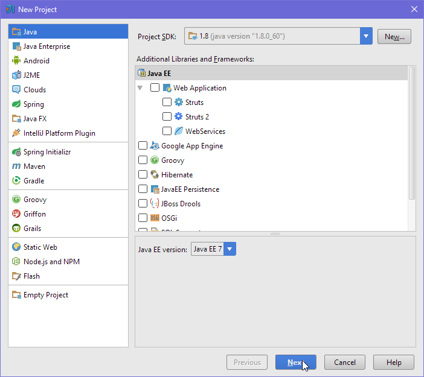➔

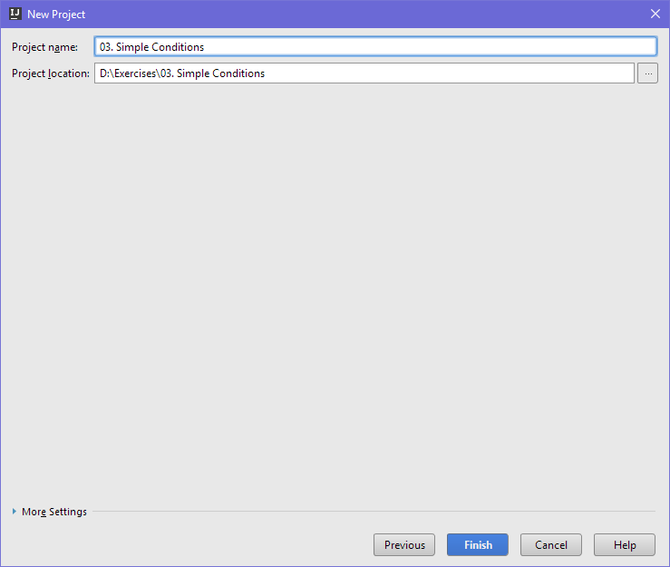

Сега имате създаден **празен IntelliJ проект** (с 0 класове в него):

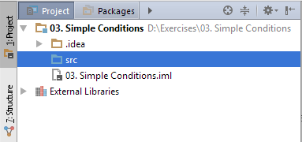

Целта на този **blank project** e да добавяте в него **по един клас за всяка задача** от упражненията.

# 1. Проверка за отлична оценка

Първата задача от тази тема е да се напише **конзолна програма**, която **чете оценка** (десетично число), въведена от потребителя, и отпечатва "**Excellent!**", ако оценката е **5.50** или по-висока.

<table>
  <tr>
    <td>вход</td>
    <td>изход</td>
    <td></td>
    <td>вход</td>
    <td>изход</td>
    <td></td>
    <td>вход</td>
    <td>изход</td>
    <td></td>
    <td>вход</td>
    <td>изход</td>
  </tr>
  <tr>
    <td>6</td>
    <td>Excellent!</td>
    <td></td>
    <td>5</td>
    <td>(няма изход)</td>
    <td></td>
    <td>5.50</td>
    <td>Excellent!</td>
    <td></td>
    <td>5.49</td>
    <td>(няма изход)</td>
  </tr>
</table>

1. Създайте **нов клас** в съществуващото IntelliJ решение. Кликнете с десен бутон на мишката върху **папката 'src'**. Изберете [New] → [Java Class]:

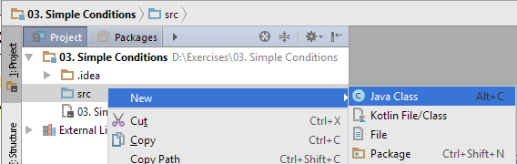➔ 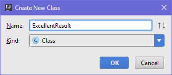

Вече имате проект с едно конзолно приложение в него. Остава да напишете кода за решаване на задачата.

2. Създайте main метод като отидете в тялото на класа „ExcellentResult" (между квадратните скоби) и напишете:

<table>
  <tr>
    <td>public static void main(String[] args) {
}</td>
  </tr>
</table>

3. Отидете в тялото на метода **main(String[]** **args)**** **(между квадратните скоби) и напишете решението на задачата. Можете да си помогнете с кода от картинката по-долу: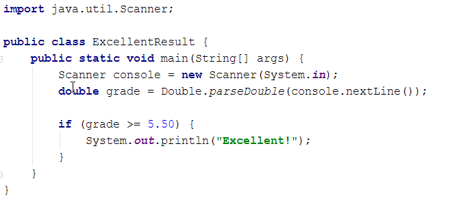

4. **Стартирайте** програмата с [Ctrl+Shift+F10] и я **тествайте** с различни входни стойности:

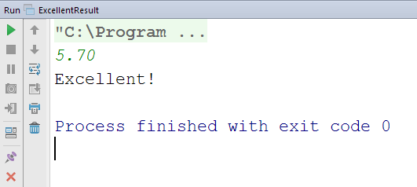    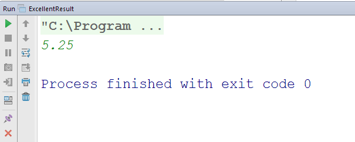

5. **Тествайте **решението си в** judge системата**: [https://judge.softuni.bg/Contests/Practice/Index/152#0](https://judge.softuni.bg/Contests/Practice/Index/152#0). Трябва да получите **100 точки** (напълно коректно решение):

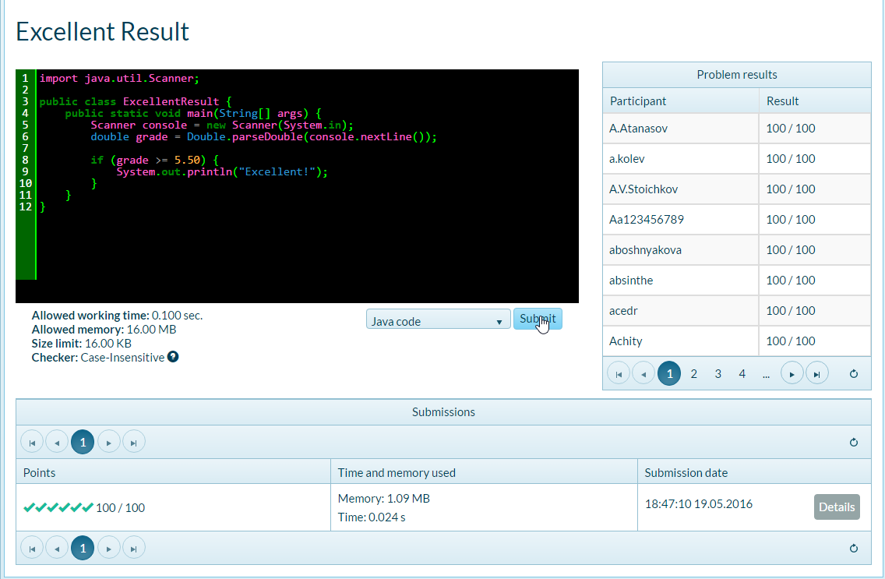

# 2. Отлична оценка или не

Следващата задача от тази тема е да се напише **конзолна програма**, която **чете оценка** (десетично число), въведена от потребителя, и отпечатва "**Excellent!**", ако оценката е **5.50** или по-висока, или “**Not excellent.**” в противен случай.

<table>
  <tr>
    <td>вход</td>
    <td>изход</td>
    <td></td>
    <td>вход</td>
    <td>изход</td>
    <td></td>
    <td>вход</td>
    <td>изход</td>
    <td></td>
    <td>вход</td>
    <td>изход</td>
  </tr>
  <tr>
    <td>6</td>
    <td>Excellent!</td>
    <td></td>
    <td>5</td>
    <td>Not excellent.</td>
    <td></td>
    <td>5.50</td>
    <td>Excellent!</td>
    <td></td>
    <td>5.49</td>
    <td>Not excellent.</td>
  </tr>
</table>

1. Първо създайте **нова Java програма** в решението "**03. Complex Conditions**".

    * Кликнете с мишката върху папката "src" и създайте в папката нов Java клас от [New] → [Java Class] с име „ExcellentOrNot”.

2. **Напишете кода** на програмата. Може да си помогнете с примерния код от картинката:

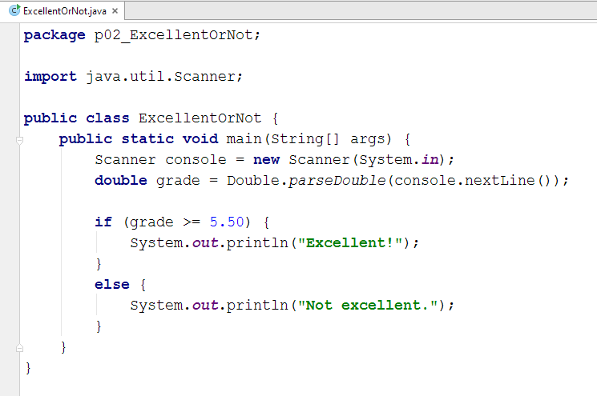

3. Сега **стартирайте програмата**, както обикновено с [Ctrl+Shift+F10] и я тествайте:

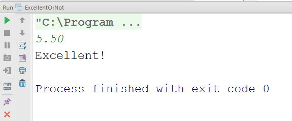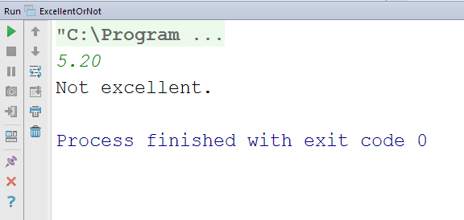

4. Тествайте в **judge системата**: [https://judge.softuni.bg/Contests/Practice/Index/152#1](https://judge.softuni.bg/Contests/Practice/Index/152#1). Решението би трябвало да бъде прието като напълно коректно:

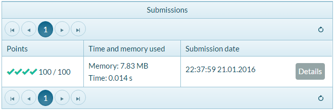

# 3. Четно или нечетно

Да се напише програма, която чете **цяло число**, въведено от потребителя, и печата дали е **четно** или **нечетно**. Примери:

<table>
  <tr>
    <td>вход</td>
    <td>изход</td>
    <td></td>
    <td>вход</td>
    <td>изход</td>
    <td></td>
    <td>вход</td>
    <td>изход</td>
    <td></td>
    <td>вход</td>
    <td>изход</td>
  </tr>
  <tr>
    <td>2</td>
    <td>even</td>
    <td></td>
    <td>3</td>
    <td>odd</td>
    <td></td>
    <td>25</td>
    <td>odd</td>
    <td></td>
    <td>1024</td>
    <td>even</td>
  </tr>
</table>

1. Първо добавете **нова Java конзолна програма**.

2. **Напишете кода** на програмата. Проверката за четност може да се реализира чрез проверка на **остатъка при деление на 2** по следния начин: **boolean even = (num % 2 == 0)**.

3. **Стартирайте** програмата с **[Ctrl+Shift+F10]** и я тествайте:

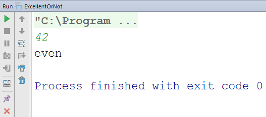

4. Тествайте в **judge системата**: [https://judge.softuni.bg/Contests/Practice/Index/152#2](https://judge.softuni.bg/Contests/Practice/Index/152#2).

# 4. Намиране на по-голямото число

Да се напише програма, която чете **две цели числа**, въведени от потребителя, и отпечатва по-голямото от двете. Примери:

<table>
  <tr>
    <td>вход</td>
    <td>изход</td>
    <td></td>
    <td>вход</td>
    <td>изход</td>
    <td></td>
    <td>вход</td>
    <td>изход</td>
    <td></td>
    <td>вход</td>
    <td>изход</td>
  </tr>
  <tr>
    <td>5
3</td>
    <td>5</td>
    <td></td>
    <td>3
5</td>
    <td>5</td>
    <td></td>
    <td>10
10</td>
    <td>10</td>
    <td></td>
    <td>-5
5</td>
    <td>5</td>
  </tr>
</table>

1. Първо добавете **нов Java конзолен проект** в съществуващия solution.

2. **Напишете кода** на програмата. Необходима е единична **if**-**else** конструкция.

3. **Стартирайте** програмата с **[Ctrl+Shift+F10]** и я тествайте:

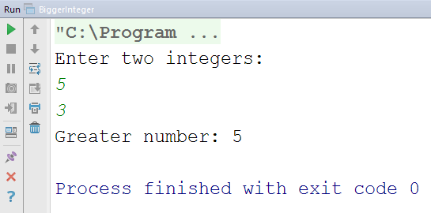

4. Тествайте решението си в **judge системата**: [https://judge.softuni.bg/Contests/Practice/Index/152#3](https://judge.softuni.bg/Contests/Practice/Index/152#3).

**Подсказка**: може да си помогнете частично с кода от картинката, който е нарочно замъглен, за да помислите как да си го напишете сами:

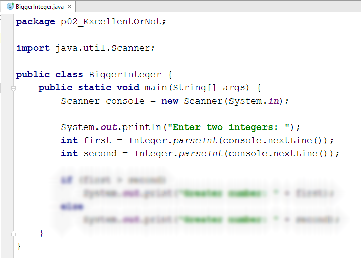

# 5. Изписване на число до 10 с думи

Да се напише програма, която чете **цяло число в диапазона [0…10]**, въведено от потребителя, и го **изписва с думи** на английски език. Ако числото е извън диапазона, изписва "**number too big**". Примери:

<table>
  <tr>
    <td>вход</td>
    <td>изход</td>
    <td></td>
    <td>вход</td>
    <td>изход</td>
    <td></td>
    <td>вход</td>
    <td>изход</td>
    <td></td>
    <td>вход</td>
    <td>изход</td>
  </tr>
  <tr>
    <td>5</td>
    <td>five</td>
    <td></td>
    <td>1</td>
    <td>one</td>
    <td></td>
    <td>9</td>
    <td>nine</td>
    <td></td>
    <td>10</td>
    <td>number too big</td>
  </tr>
</table>

Тествайте решението си в **judge системата**: [https://judge.softuni.bg/Contests/Practice/Index/152#4](https://judge.softuni.bg/Contests/Practice/Index/152#4).

**Подсказка**: можете да напишете дълга **if**-**else**-**if**-**else**…**else**, с която да разгледате възможните **11 случая**.

# 6. Бонус точки

Дадено е **цяло число** – брой точки. Върху него се начисляват **бонус точки** по правилата, описани по-долу. Да се напише програма, която пресмята **бонус точките** за това число и **общия брой точки** с бонусите.

* Ако числото е **до 100** включително, бонус точките са **5**.

* Ако числото е **по-голямо от 100**, бонус точките са **20%** от числото.

* Ако числото е **по-голямо от 1000**, бонус точките са **10%** от числото.

* Допълнителни бонус точки (начисляват се отделно от предходните):

    * За **четно** число → + 1 т.

    * За число, което **завършва на 5** → + 2 т.

Примери:

<table>
  <tr>
    <td>вход</td>
    <td>изход</td>
    <td></td>
    <td>вход</td>
    <td>изход</td>
    <td></td>
    <td>вход</td>
    <td>изход</td>
    <td></td>
    <td>вход</td>
    <td>изход</td>
  </tr>
  <tr>
    <td>20</td>
    <td>6
26</td>
    <td></td>
    <td>175</td>
    <td>37
212</td>
    <td></td>
    <td>2703</td>
    <td>270.3
2973.3</td>
    <td></td>
    <td>15875</td>
    <td>1589.5
17464.5</td>
  </tr>
</table>

Ето как би могло да изглежда решението на задачата в действие:

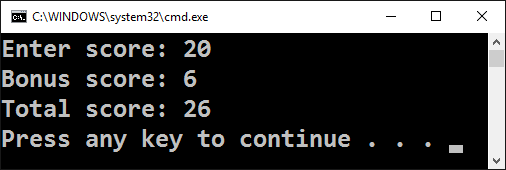

Тествайте решението си в **judge системата**: [https://judge.softuni.bg/Contests/Practice/Index/152#5](https://judge.softuni.bg/Contests/Practice/Index/152#5).

**Подсказка**:

* Основните бонус точки можете да изчислите с **if**-**else**-**if**-**else**-**if** конструкция (имате 3 случая).

* Допълнителните бонус точки можете да изчислите с **if**-**else**-**if** конструкция (имате още 2 случая).

# 7. Сумиране на секунди

Трима спортни състезатели финишират за някакъв **брой секунди** (между **1** и **50**). Да се напише програма, която чете времената на състезателите, въведени от потребителя, и пресмята **сумарното им време** във формат "**минути:секунди**". Секундите да се изведат с **водеща нула** (2 → "02", 7 → "07", 35 → "35"). Примери:

<table>
  <tr>
    <td>вход</td>
    <td>изход</td>
    <td></td>
    <td>вход</td>
    <td>изход</td>
    <td></td>
    <td>вход</td>
    <td>изход</td>
    <td></td>
    <td>вход</td>
    <td>изход</td>
  </tr>
  <tr>
    <td>35
45
44</td>
    <td>2:04</td>
    <td></td>
    <td>22
7
34</td>
    <td>1:03</td>
    <td></td>
    <td>50
50
49</td>
    <td>2:29</td>
    <td></td>
    <td>14
12
10</td>
    <td>0:36</td>
  </tr>
</table>

Тествайте решението си в **judge системата**: [https://judge.softuni.bg/Contests/Practice/Index/152#6](https://judge.softuni.bg/Contests/Practice/Index/152#6).

**Подсказка**:

* Сумирайте трите числа и получете резултата в секунди. Понеже **1 минута = 60 секунди**, ще трябва да изчислите броя минути и броя секунди в диапазона от 0 до 59.

* Ако резултатът е между 0 и 59, отпечатайте 0 минути + изчислените секунди.

* Ако резултатът е между 60 и 119, отпечатайте 1 минута + изчислените секунди минус 60.

* Ако резултатът е между 120 и 179, отпечатайте 2 минути + изчислените секунди минус 120.

* Ако секундите са по-малко от 10, изведете водеща нула преди тях.

# 8. Конвертор за мерни единици

Да се напише програма, която **преобразува разстояние** между следните 8 **мерни единици**: **m**, **mm**, **cm**, **mi**, **in**, **km**, **ft**, **yd**. Използвайте съответствията от таблицата по-долу:

<table>
  <tr>
    <td>входна единица</td>
    <td>изходна единица</td>
  </tr>
  <tr>
    <td>1 meter (m)</td>
    <td>1000 millimeters (mm)</td>
  </tr>
  <tr>
    <td>1 meter (m)</td>
    <td>100 centimeters (cm)</td>
  </tr>
  <tr>
    <td>1 meter (m)</td>
    <td>0.000621371192 miles (mi)</td>
  </tr>
  <tr>
    <td>1 meter (m)</td>
    <td>39.3700787 inches (in)</td>
  </tr>
  <tr>
    <td>1 meter (m)</td>
    <td>0.001 kilometers (km)</td>
  </tr>
  <tr>
    <td>1 meter (m)</td>
    <td>3.2808399 feet (ft)</td>
  </tr>
  <tr>
    <td>1 meter (m)</td>
    <td>1.0936133 yards (yd)</td>
  </tr>
</table>

Входните данни се състоят от три реда, въведени от потребителя:

* Първи ред: число за преобразуване

* Втори ред: входна мерна единица

* Трети ред: изходна мерна единица (за резултата)

Резултатът **да се форматира** до **осмия знак след десетичната запетая**.

Примерен вход и изход:

<table>
  <tr>
    <td>вход</td>
    <td>изход</td>
    <td></td>
    <td>вход</td>
    <td>изход</td>
    <td></td>
    <td>вход</td>
    <td>изход</td>
  </tr>
  <tr>
    <td>12
km
ft</td>
    <td>39370. 07886932 ft</td>
    <td></td>
    <td>150 mi in</td>
    <td>9503999.99393599 in</td>
    <td></td>
    <td>450
yd
km</td>
    <td>0.41148000 km</td>
  </tr>
</table>

Тествайте решението си в **judge системата**: [https://judge.softuni.bg/Contests/Practice/Index/152#7](https://judge.softuni.bg/Contests/Practice/Index/152#7).

# 9. Познай паролата

Да се напише програма, която **чете парола** (един ред с произволен текст), въведена от потребителя, и проверява дали въведеното **съвпада** с фразата "**s3cr3t!P@ssw0rd**".** **При съвпадение да се изведе “**Welcome**”. При несъвпадение да се изведе “**Wrong password!**”. Примери:

<table>
  <tr>
    <td>вход</td>
    <td>изход</td>
    <td></td>
    <td>вход</td>
    <td>изход</td>
    <td></td>
    <td>вход</td>
    <td>изход</td>
  </tr>
  <tr>
    <td>qwerty</td>
    <td>Wrong password!</td>
    <td></td>
    <td>s3cr3t!P@ssw0rd</td>
    <td>Welcome</td>
    <td></td>
    <td>s3cr3t!p@ss</td>
    <td>Wrong password!</td>
  </tr>
</table>

Тествайте решението си в **judge системата**: [https://judge.softuni.bg/Contests/Practice/Index/152#8](https://judge.softuni.bg/Contests/Practice/Index/152#8).

**Подсказка**: използвайте **if**-**else** конструкцията.

# 10. Число от 100 до 200

Да се напише програма, която **чете цяло число**, въведено от потребителя, и проверява дали е **под 100**, **между 100 и 200** или **над 200**. Да се отпечатат съответно съобщения като в примерите по-долу:

<table>
  <tr>
    <td>вход</td>
    <td>изход</td>
    <td></td>
    <td>вход</td>
    <td>изход</td>
    <td></td>
    <td>вход</td>
    <td>изход</td>
  </tr>
  <tr>
    <td>95</td>
    <td>Less than 100</td>
    <td></td>
    <td>120</td>
    <td>Between 100 and 200</td>
    <td></td>
    <td>210</td>
    <td>Greater than 200</td>
  </tr>
</table>

Тествайте решението си в **judge системата**: [https://judge.softuni.bg/Contests/Practice/Index/152#9](https://judge.softuni.bg/Contests/Practice/Index/152#9).

**Подсказка**: използвайте **if**-**else**-**if**-**else** конструкция за да проверите всеки от трите случая.

# 11. Еднакви думи

Да се напише програма, която **чете две думи**, въведени от потребителя, и проверява дали са еднакви. Да не се прави разлика между главни и малки думи. Да се изведе "**yes**" или “**no**”. Примери:

<table>
  <tr>
    <td>вход</td>
    <td>изход</td>
    <td></td>
    <td>вход</td>
    <td>изход</td>
    <td></td>
    <td>вход</td>
    <td>изход</td>
    <td></td>
    <td>вход</td>
    <td>изход</td>
    <td></td>
    <td>вход</td>
    <td>изход</td>
  </tr>
  <tr>
    <td>Hello
Hello</td>
    <td>yes</td>
    <td></td>
    <td>SoftUni
softuni</td>
    <td>yes</td>
    <td></td>
    <td>Soft
Uni</td>
    <td>no</td>
    <td></td>
    <td>beer
vodka</td>
    <td>no</td>
    <td></td>
    <td>HeLlO
hELLo</td>
    <td>yes</td>
  </tr>
</table>

Тествайте решението си в **judge системата**: [https://judge.softuni.bg/Contests/Practice/Index/152#10](https://judge.softuni.bg/Contests/Practice/Index/152#10).

**Подсказка**: използвайте **if**-**else** конструкция. Преди сравняване на думите ги обърнете в долен регистър: **word = word.toLower()**.

# 12. Информация за скоростта

Да се напише програма, която **чете скорост** (десетично число), въведена от потребителя,** **и отпечатва **информация за скоростта**. При скорост **до 10** (включително) отпечатайте "**slow**". При скорост **над 10** и **до 50** отпечатайте “**average**”. При скорост **над 50** и **до 150** отпечатайте “**fast**”. При скорост **над 150** и **до 1000** отпечатайте “**ultra fast**”. При по-висока скорост отпечатайте “**extremely fast**”. Примери:

<table>
  <tr>
    <td>вход</td>
    <td>изход</td>
    <td></td>
    <td>вход</td>
    <td>изход</td>
    <td></td>
    <td>вход</td>
    <td>изход</td>
    <td></td>
    <td>вход</td>
    <td>изход</td>
    <td></td>
    <td>вход</td>
    <td>изход</td>
  </tr>
  <tr>
    <td>8</td>
    <td>slow</td>
    <td></td>
    <td>49.5</td>
    <td>average</td>
    <td></td>
    <td>126</td>
    <td>fast</td>
    <td></td>
    <td>160</td>
    <td>ultra fast</td>
    <td></td>
    <td>3500</td>
    <td>extremely fast</td>
  </tr>
</table>

Тествайте решението си в **judge системата**: [https://judge.softuni.bg/Contests/Practice/Index/152#11](https://judge.softuni.bg/Contests/Practice/Index/152#11).

**Подсказка**: използвайте серия от **if**-**else**-**if**-**else****-**… конструкции, за да хванете всичките 5 случая.

# 13. Лица на фигури

Да се напише програма, в която потребителят **въвежда вида и размерите на геометрична **фигура и пресмята лицето й. Фигурите са четири вида: квадрат (**square**), правоъгълник (**rectangle**), кръг (**circle**) и триъгълник (**triangle**). На първия ред на входа се чете вида на фигурата (**square**, **rectangle**, **circle** или **triangle**). Ако фигурата е **квадрат**, на следващия ред се чете едно число – дължина на страната му. Ако фигурата е **правоъгълник**, на следващите два реда четат две числа – дължините на страните му. Ако фигурата е **кръг**, на следващия ред чете едно число – радиусът на кръга. Ако фигурата е **триъгълник**, на следващите два реда четат две числа – дължината на страната му и дължината на височината към нея. Резултатът да се закръгли до **3 цифри след десетичната точка**. Примери:

<table>
  <tr>
    <td>вход</td>
    <td>изход</td>
    <td></td>
    <td>вход</td>
    <td>изход</td>
    <td></td>
    <td>вход</td>
    <td>изход</td>
    <td></td>
    <td>вход</td>
    <td>изход</td>
  </tr>
  <tr>
    <td>square
5</td>
    <td>25</td>
    <td></td>
    <td>rectangle
7
2.5</td>
    <td>17.5</td>
    <td></td>
    <td>circle
6</td>
    <td>113.097</td>
    <td></td>
    <td>triangle
4.5
20</td>
    <td>45</td>
  </tr>
</table>

Тествайте решението си в **judge системата**: [https://judge.softuni.bg/Contests/Practice/Index/152#12](https://judge.softuni.bg/Contests/Practice/Index/152#12).

**Подсказка**: използвайте серия от **if**-**else**-**if**-**else****-**… конструкции, за да обработите 4-те вида фигури.

# 14. Време + 15 минути

Да се напише програма, която **чете час и минути** от 24-часово денонощие, въведени от потребителя, и изчислява колко ще е **часът след 15 минути**. Резултатът да се отпечата във формат **hh:mm**. Часовете винаги са между 0 и 23, а минутите винаги са между 0 и 59. Часовете се изписват с една или две цифри. Минутите се изписват винаги с по две цифри, с **водеща нула** когато е необходимо. Примери:

<table>
  <tr>
    <td>вход</td>
    <td>изход</td>
    <td></td>
    <td>вход</td>
    <td>изход</td>
    <td></td>
    <td>вход</td>
    <td>изход</td>
    <td></td>
    <td>вход</td>
    <td>изход</td>
    <td></td>
    <td>вход</td>
    <td>изход</td>
  </tr>
  <tr>
    <td>1
46</td>
    <td>2:01</td>
    <td></td>
    <td>0
01</td>
    <td>0:16</td>
    <td></td>
    <td>23
59</td>
    <td>0:14</td>
    <td></td>
    <td>11
08</td>
    <td>11:23</td>
    <td></td>
    <td>12
49</td>
    <td>13:04</td>
  </tr>
</table>

Тествайте решението си в **judge системата**: [https://judge.softuni.bg/Contests/Practice/Index/152#13](https://judge.softuni.bg/Contests/Practice/Index/152#13).

**Подсказка**: добавете 15 минути и направете няколко проверки. Ако минутите надвишат 59, увеличете часовете с 1 и намалете минутите със 60. По аналогичен начин разгледайте случая, когато часовете надвишат 23. При печатането на минутите проверете за водеща нула.

# 15. Еднакви 3 числа

Да се въведат 3 числа и да се отпечата дали са еднакви (yes / no)

Примери:

<table>
  <tr>
    <td>вход</td>
    <td>изход</td>
    <td></td>
    <td>вход</td>
    <td>изход</td>
    <td></td>
    <td>вход</td>
    <td>изход</td>
    <td></td>
    <td>вход</td>
    <td>изход</td>
    <td></td>
    <td>вход</td>
    <td>изход</td>
  </tr>
  <tr>
    <td>1
1
1</td>
    <td>yes</td>
    <td></td>
    <td>5
5
5</td>
    <td>yes</td>
    <td></td>
    <td>1
2
3</td>
    <td>no</td>
    <td></td>
    <td>11
8
5</td>
    <td>no</td>
    <td></td>
    <td>13
14
99</td>
    <td>no</td>
  </tr>
</table>

Тествайте решението си в **judge системата**: [https://judge.softuni.bg/Contests/Practice/Index/152#14](https://judge.softuni.bg/Contests/Practice/Index/152#14).

# 16. Изписване на число до 100 с думи

Да се напише програма, която превръща число [0…100] в текст: 25 → "twenty five". Ако числото не е в диапазона, принтирайте „**invalid number**”.

Примери:

<table>
  <tr>
    <td>вход</td>
    <td>изход</td>
    <td></td>
    <td>вход</td>
    <td>изход</td>
    <td></td>
    <td>вход</td>
    <td>изход</td>
    <td></td>
    <td>вход</td>
    <td>изход</td>
  </tr>
  <tr>
    <td>0
</td>
    <td>zero</td>
    <td></td>
    <td>67</td>
    <td>sixty seven</td>
    <td></td>
    <td>-1</td>
    <td>invalid number</td>
    <td></td>
    <td>14</td>
    <td>fourteen</td>
  </tr>
</table>

Тествайте решението си в **judge системата**: [https://judge.softuni.bg/Contests/Practice/Index/152#15](https://judge.softuni.bg/Contests/Practice/Index/152#15).

