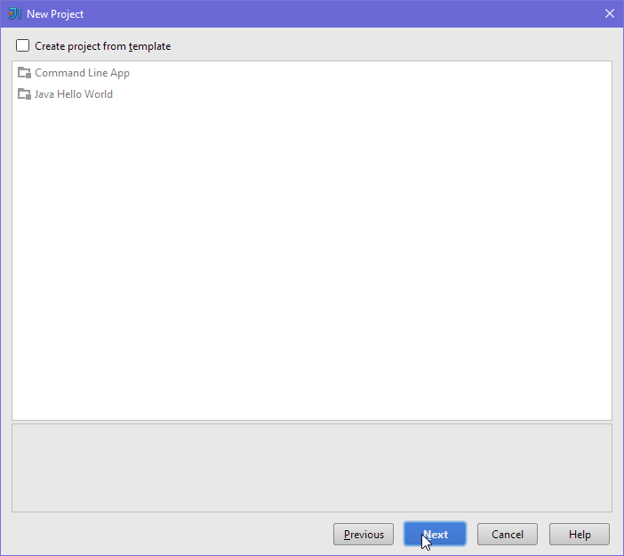
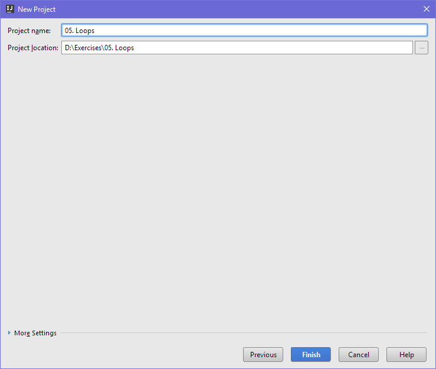
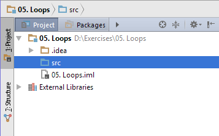
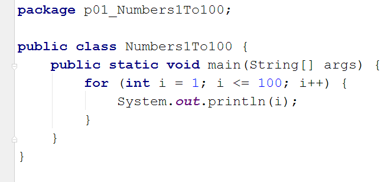
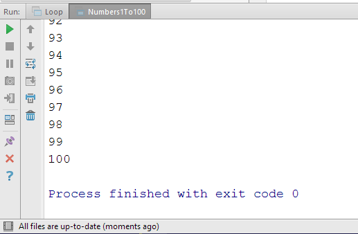

# Упражнения: Повторения (цикли)

Задачи за упражнение в клас и за домашно към курса [„Основи на програмирането" @ СофтУни](https://softuni.bg/courses/programming-basics).

# 1. Празно IntelliJ решение (Blank Project)

Създайте празно решение (Blank Project) във IntelliJ. Класовете в IntelliJ обединяват група проекти. Тази възможност е изключително удобна, когато искаме да работим по няколко проекта и бързо да превключваме между тях или искаме да обединим логически няколко взаимосвързани проекта.

В настоящото практическо занимание ще използваме Java проект и няколко класа, за да ор**г**анизираме решенията на задачите от упражненията – всяка задача в отделен клас в общ проект.

1. Стартирайте IntelliJ IDEA.

2. Създайте нов проект: [Create New Project].

3. Изберете от диалоговия прозорец [Java] → [Next] → [Next] и дайте подходящо име на проекта, например „**Loops**":

➔

Сега имате създаден **празен IntelliJ проект** (с 0 пакета в него):

Целта на този **blank project** e да добавяте в него **по един пакет за всяка задача** от упражненията.

# 2. Числа от 1 до 100

Напишете програма, която отпечатва числата от 1 до 100, по едно на ред.

<table>
  <tr>
    <td>вход</td>
    <td>изход</td>
  </tr>
  <tr>
    <td>(няма)</td>
    <td>1
2
3
…
98
99
100</td>
  </tr>
</table>

**Подсказки**:

1. Създайте **нов клас** в съществуващото IntelliJ IDEA решение – конзолна Java програма. Задайте подходящо име на класа, например "**Numbers1To100**".

2. Отидете в тялото на метода **main(String[]** **args)** и напишете решението на задачата. Можете да си помогнете с кода от картинката по-долу:

3. **Стартирайте** програмата с [Ctrl+Shift+F10] и я **тествайте**:

   

4. **Тествайте **решението си в** judge системата**: [https://judge.softuni.bg/Contests/Practice/Index/154#0](https://judge.softuni.bg/Contests/Practice/Index/154#0). Трябва да получите **100 точки** (напълно коректно решение).

# 3. Числа до 1000, завършващи на 7

Напишете програма, която отпечатва числата в диапазона **[1…1000]**, които **завършват на 7**.

<table>
  <tr>
    <td>вход</td>
    <td>изход</td>
  </tr>
  <tr>
    <td>(няма)</td>
    <td>7
17
27
…
997</td>
  </tr>
</table>

**Тествайте **решението си в** judge системата**: [https://judge.softuni.bg/Contests/Practice/Index/154#1](https://judge.softuni.bg/Contests/Practice/Index/154#1).

**Подсказка**: можете да завъртите **for**-цикъл от 1 до 1000 и да проверите всяко число дали завършва на 7. Едно число **num** завършва на 7, когато **(num** **%** **10** **==** **7)**.

# 4. Всички латински букви

Напишете програма, която отпечатва всички букви от латинската азбука: **a**, **b**, **c**, …, **z**.

**Тествайте **решението си в** judge системата**: [https://judge.softuni.bg/Contests/Practice/Index/154#2](https://judge.softuni.bg/Contests/Practice/Index/154#2).

**Подсказка**: можете да завъртите **for**-цикъл от **'a'** до **'z'** (освен числа може да въртите в цикъл и букви).

# 5. Сумиране на числа

Да се напише програма, която **чете ****n-**на брой** цели числа**, въведени от потребителя, **и ги сумира**.

* От първия ред на входа се въвежда броят числа **n**.

* От следващите **n** реда се въвежда по едно цяло число.

Програмата трябва да прочете числата, да ги сумира и да отпечата сумата им. Примери:

<table>
  <tr>
    <td>вход</td>
    <td>изход</td>
    <td></td>
    <td>вход</td>
    <td>изход</td>
    <td></td>
    <td>вход</td>
    <td>изход</td>
    <td></td>
    <td>вход</td>
    <td>изход</td>
    <td></td>
    <td>вход</td>
    <td>изход</td>
  </tr>
  <tr>
    <td>2
10
20</td>
    <td>30</td>
    <td></td>
    <td>3
-10
-20
-30</td>
    <td>-60</td>
    <td></td>
    <td>4
45
-20
7
11</td>
    <td>43</td>
    <td></td>
    <td>1
999</td>
    <td>999</td>
    <td></td>
    <td>0</td>
    <td>0</td>
  </tr>
</table>

**Тествайте **решението си в** judge системата**: [https://judge.softuni.bg/Contests/Practice/Index/154#3](https://judge.softuni.bg/Contests/Practice/Index/154#3).

**Подсказки**:

* Първо въведете едно число **n** (броят числа, които предстои да бъдат въведени).

* Инициализирайте **sum** **=** **0** (в началото няма още прочетени числа, и съответно сумата е празна).

* В цикъл **n**** пъти** прочетете по едно цяло число **num** и го прибавете към сумата (**sum** **=** **sum** **+** **num**).

* Накрая в **sum** трябва да се е запазила сумата на прочетените числа. Отпечатайте я.

# 6. Най-голямо число

Напишете програма, която чете **n-на брой**** цели числа** (**n** > 0), въведени от потребителя, и намира **най-голямото** измежду тях. Първо се въвежда броят числа **n**, а след това самите **n** числа, по едно на ред. Примери:

<table>
  <tr>
    <td>вход</td>
    <td>изход</td>
    <td></td>
    <td>вход</td>
    <td>изход</td>
    <td></td>
    <td>вход</td>
    <td>изход</td>
    <td></td>
    <td>вход</td>
    <td>изход</td>
    <td></td>
    <td>вход</td>
    <td>изход</td>
  </tr>
  <tr>
    <td>2
100
99</td>
    <td>100</td>
    <td></td>
    <td>3
-10
20
-30</td>
    <td>20</td>
    <td></td>
    <td>4
45
-20
7
99</td>
    <td>99</td>
    <td></td>
    <td>1
999</td>
    <td>999</td>
    <td></td>
    <td>2
-1
-2</td>
    <td>-1</td>
  </tr>
</table>

**Тествайте **решението си в** judge системата**: [https://judge.softuni.bg/Contests/Practice/Index/154#4](https://judge.softuni.bg/Contests/Practice/Index/154#4).

**Подсказки**:

* Първо въведете едно число **n** (броят числа, които предстои да бъдат въведени).

* Въведете от конзолата първото число. Сложете текущият максимум **max** да е прочетеното число.

* В цикъл **n****-1 пъти** прочетете по едно цяло число **num**. Ако прочетеното число **num** е по-голямо от текущият максимум **max**, запомнете **num** в **max**.

* Накрая в **max** трябва да се е запазило най-голямото число. Отпечатайте го.

# 7. Най-малко число

Напишете програма, която чете **n-на брой**** цели числа** (**n** > 0), въведени от потребителя, и намира **най-малкото** измежду тях. Първо се въвежда броят числа **n**, а след това самите **n** числа, по едно на ред. Примери:

<table>
  <tr>
    <td>вход</td>
    <td>изход</td>
    <td></td>
    <td>вход</td>
    <td>изход</td>
    <td></td>
    <td>вход</td>
    <td>изход</td>
    <td></td>
    <td>вход</td>
    <td>изход</td>
    <td></td>
    <td>вход</td>
    <td>изход</td>
  </tr>
  <tr>
    <td>2
100
99</td>
    <td>99</td>
    <td></td>
    <td>3
-10
20
-30</td>
    <td>-30</td>
    <td></td>
    <td>4
45
-20
7
99</td>
    <td>-20</td>
    <td></td>
    <td>1
999</td>
    <td>999</td>
    <td></td>
    <td>2
-1
-2</td>
    <td>-2</td>
  </tr>
</table>

**Тествайте **решението си в** judge системата**: [https://judge.softuni.bg/Contests/Practice/Index/154#5](https://judge.softuni.bg/Contests/Practice/Index/154#5).

**Подсказки**: задачата е абсолютно аналогична с предходната.

# 8. Лява и дясна сума

Да се напише програма, която чете **2*****n-на брой** цели числа, подадени от потребителя, и проверява дали **сумата на първите ****n**** числа** (лява сума) е равна на **сумата на вторите ****n**** числа** (дясна сума). При равенство печата "**Yes**" + **сумата**; иначе печата "**No**" + **разликата**. Разликата се изчислява като положително число (по абсолютна стойност). Примери:

<table>
  <tr>
    <td>вход</td>
    <td>изход</td>
    <td>коментар</td>
    <td></td>
    <td>вход</td>
    <td>изход</td>
    <td>коментар</td>
  </tr>
  <tr>
    <td>2
10
90
60
40</td>
    <td>Yes, sum = 100</td>
    <td>10+90 = 60+40 = 100</td>
    <td></td>
    <td>2
90
9
50
50</td>
    <td>No, diff = 1</td>
    <td>90+9 ≠ 50+50
Difference = |99-100| = 1</td>
  </tr>
</table>

**Тествайте **решението си в** judge системата**: [https://judge.softuni.bg/Contests/Practice/Index/154#6](https://judge.softuni.bg/Contests/Practice/Index/154#6).

**Подсказки**:

* Въведете **n**.

* Въведете първите **n** числа (**лявата** половина) и ги сумирайте.

* Въведете още **n** числа (**дясната** половина) и ги сумирайте.

* Изчислете **разликата** между сумите по абсолютна стойност: **Math.Abs(leftSum** **-** **rightSum)**.

* Ако разликата е **0**, отпечатайте "**Yes**" + **сумата**; иначе отпечатайте "**No**" + **разликата**.

# 9. Четна / нечетна сума

Да се напише програма, която чете **n-на брой** цели числа, подадени от потребителя, и проверява дали **сумата от числата на четни позиции **е равна на** сумата на числата на нечетни позиции**. При равенство да се отпечата "**Yes**" + **сумата**; иначе да се отпечата "**No**" + **разликата**. Разликата се изчислява по абсолютна стойност. Примери:

<table>
  <tr>
    <td>вход</td>
    <td>изход</td>
    <td>коментар</td>
    <td></td>
    <td>вход</td>
    <td>изход</td>
    <td>коментар</td>
    <td></td>
    <td>вход</td>
    <td>изход</td>
    <td>коментар</td>
  </tr>
  <tr>
    <td>4
10
50
60
20</td>
    <td>Yes
Sum = 70</td>
    <td>10+60 = 50+20 = 70</td>
    <td></td>
    <td>4
3
5
1
-2</td>
    <td>No
Diff = 1</td>
    <td>3+1 ≠ 5-2
Diff =
|4-3| = 1</td>
    <td></td>
    <td>3
5
8
1</td>
    <td>No
Diff = 2</td>
    <td>5+1 ≠ 8
Diff =
|6-8| = 2</td>
  </tr>
</table>

**Тествайте **решението си в** judge системата**: [https://judge.softuni.bg/Contests/Practice/Index/154#7](https://judge.softuni.bg/Contests/Practice/Index/154#7).

**Подсказки**: Въведете числата едно по едно и изчислете двете **суми** (числа на **четни** позиции и числа на **нечетни** позиции). Както в предходната задача, изчислете абсолютна стойност на разликата и отпечатайте резултата ("**Yes**" + **сумата** при разлика 0 или "**No**" + **разликата** в противен случай).

# 10. Сумиране на гласните букви

Да се напише програма, която чете **текст** (стринг), въведен от потребителя, и изчислява и отпечатва **сумата от стойностите на гласните букви** според таблицата по-долу:

<table>
  <tr>
    <td>буква</td>
    <td>a</td>
    <td>e</td>
    <td>i</td>
    <td>o</td>
    <td>u</td>
  </tr>
  <tr>
    <td>стойност</td>
    <td>1</td>
    <td>2</td>
    <td>3</td>
    <td>4</td>
    <td>5</td>
  </tr>
</table>

Примери: 

<table>
  <tr>
    <td>вход</td>
    <td>изход</td>
    <td>коментар</td>
  </tr>
  <tr>
    <td>hello</td>
    <td>6</td>
    <td>e + o = 2 + 4 = 6</td>
  </tr>
  <tr>
    <td>hi</td>
    <td>3</td>
    <td>i = 3</td>
  </tr>
  <tr>
    <td>bamboo</td>
    <td>9</td>
    <td>a + o + o = 1 + 4 + 4 = 9</td>
  </tr>
  <tr>
    <td>beer</td>
    <td>4</td>
    <td>e + e = 2 + 2 = 4</td>
  </tr>
</table>

**Тествайте **решението си в** judge системата**: [https://judge.softuni.bg/Contests/Practice/Index/154#8](https://judge.softuni.bg/Contests/Practice/Index/154#8).

**Подсказки**:

* Прочетете входния текст **s**. Нулирайте сумата.

* Завъртете цикъл от **0** до **s.Length-1** (дължината на текста -1).

* Проверете всяка буква **s.charAt(i)** дали е гласна и съответно добавете към сумата стойността й.

# 11. * Елемент, равен на сумата на останалите

Да се напише програма, която чете **n-на брой** цели числа, въведени от потребителя, и проверява дали сред тях съществува число, което е равно на сумата на всички останали. Ако има такъв елемент, печата "**Yes**", "**Sum = **"  + **неговата стойност**; иначе печата "**No**", "**Diff = **" + **разликата между най-големия елемент и сумата на останалите** (по абсолютна стойност). Примери:

<table>
  <tr>
    <td>вход</td>
    <td>изход</td>
    <td>коментари</td>
  </tr>
  <tr>
    <td>7
3
4
1
1
2
12
1</td>
    <td>Yes
Sum = 12</td>
    <td>3 + 4 + 1 + 2 + 1 + 1 = 12</td>
  </tr>
  <tr>
    <td>4
6
1
2
3</td>
    <td>Yes
Sum = 6</td>
    <td>1 + 2 + 3 = 12</td>
  </tr>
  <tr>
    <td>3
1
1
10</td>
    <td>No
Diff = 8</td>
    <td>|10 - (1 + 1)| = 8</td>
  </tr>
  <tr>
    <td>3
5
5
1</td>
    <td>No
Diff = 1</td>
    <td>|5 - (5 + 1)| = 1 </td>
  </tr>
  <tr>
    <td>3
1
1
1</td>
    <td>No
Diff = 1</td>
    <td></td>
  </tr>
</table>

**Тествайте **решението си в** judge системата**: [https://judge.softuni.bg/Contests/Practice/Index/154#9](https://judge.softuni.bg/Contests/Practice/Index/154#9).

**Подсказка**: изчислете **сумата** на всички елементи и **най-големият** от тях и проверете търсеното условие.

# 12. * Четни / нечетни позиции

Напишете програма, която чете **n-на брой** **числа**, въведени от потребителя, и пресмята **сумата**, **минимума** и **максимума** на числата на **четни** и **нечетни** позиции (броим от 1). Когато няма минимален / максимален елемент, отпечатайте "**No**". 

Изходът да се форматира в следния вид:

"**OddSum=**" + {**сума** на числата на **нечетни** позиции},

"**OddMin=**" + { **минимална** стойност на числата на **нечетни** позиции } / {"**No**"},

"**OddMax=**" + { **максимална** стойност на числата на **нечетни** позиции } / {"**No**"},

"**EvenSum=**" + { **сума** на числата на **четни** позиции },

"**EvenMin=**" + { **минимална** стойност на числата на **четни** позиции } / {"**No**"},

"**EvenMax=**" + { **максимална** стойност на числата на **четни** позиции } / {"**No**"}

Примери:

<table>
  <tr>
    <td>вход</td>
    <td>изход</td>
    <td></td>
    <td>вход</td>
    <td>изход</td>
    <td></td>
    <td>вход</td>
    <td>изход</td>
    <td></td>
    <td>вход</td>
    <td>изход</td>
  </tr>
  <tr>
    <td>6
2
3
5
4
2
1</td>
    <td>OddSum=9, OddMin=2, OddMax=5, EvenSum=8, EvenMin=1, EvenMax=4</td>
    <td></td>
    <td>2
1.5
-2.5</td>
    <td>OddSum=1.5, OddMin=1.5, OddMax=1.5, EvenSum=-2.5, EvenMin=-2.5, EvenMax=-2.5</td>
    <td></td>
    <td>1
1</td>
    <td>OddSum=1, OddMin=1, OddMax=1, EvenSum=0, EvenMin=No, EvenMax=No</td>
    <td></td>
    <td>0</td>
    <td>OddSum=0, OddMin=No, OddMax=No, EvenSum=0, EvenMin=No, EvenMax=No</td>
  </tr>
</table>

<table>
  <tr>
    <td>вход</td>
    <td>изход</td>
    <td></td>
    <td>вход</td>
    <td>изход</td>
    <td></td>
    <td>вход</td>
    <td>изход</td>
    <td></td>
    <td>вход</td>
    <td>изход</td>
  </tr>
  <tr>
    <td>5
3
-2
8
11
-3</td>
    <td>OddSum=8, OddMin=-3, OddMax=8, EvenSum=9, EvenMin=-2, EvenMax=11</td>
    <td></td>
    <td>4
1.5
1.75
1.5
1.75</td>
    <td>OddSum=3, OddMin=1.5, OddMax=1.5, EvenSum=3.5, EvenMin=1.75, EvenMax=1.75</td>
    <td></td>
    <td>1
-5</td>
    <td>OddSum=-5, OddMin=-5, OddMax=-5, EvenSum=0, EvenMin=No, EvenMax=No</td>
    <td></td>
    <td>3
-1
-2
-3</td>
    <td>OddSum=-4, OddMin=-3, OddMax=-1, EvenSum=-2, EvenMin=-2, EvenMax=-2</td>
  </tr>
</table>

**Тествайте **решението си в** judge системата**: [https://judge.softuni.bg/Contests/Practice/Index/154#10](https://judge.softuni.bg/Contests/Practice/Index/154#10).

**Подсказки**:

* Задача обединява няколко предходни задачи: намиране на **минимум**, намиране на **максимум**, намиране на **сума** и обработка на елементите от **четни и нечетни позиции**. Припомнете си ги.

* Работете с **дробни числа** (не цели). Сумата, минимумът и максимумът също са дробни числа.

* Използвайте **неутрална начална стойност** при намиране на минимум / максимум, например **1000000000.0** и **-1000000000.0**. Ако получите накрая неутралната стойност, печатайте "**No**".

# 13. * Еднакви двойки

Дадени са 2***n-на брой** числа. Първото и второто формират **двойка**, третото и четвъртото също и т.н. Всяка двойка има **стойност** – сумата от съставящите я числа. Напишете програма, която проверява **дали всички двойки имат еднаква стойност** или печата **максималната разлика** между две последователни двойки. Ако всички двойки имат еднаква стойност, отпечатайте "**Yes, value={Value}**" + **стойността**. В противен случай отпечатайте "**No, maxdiff={Difference}**" + **максималната разлика**. Примери:

<table>
  <tr>
    <td>вход</td>
    <td>изход</td>
    <td>коментари</td>
    <td></td>
    <td>вход</td>
    <td>изход</td>
    <td>коментари</td>
  </tr>
  <tr>
    <td>3
1
2
0
3
4
-1</td>
    <td>Yes, value=3</td>
    <td>стойности = {3, 3, 3}
еднакви стойности</td>
    <td></td>
    <td>2
1
2
2
2</td>
    <td>No, maxdiff=1</td>
    <td>стойности = {3, 4}
разлики = {1}
макс. разлика = 1</td>
  </tr>
  <tr>
    <td>4
1
1
3
1
2
2
0
0</td>
    <td>No, maxdiff=4</td>
    <td>стойности = {2, 4, 4, 0}
разлики = {2, 0, 4}
макс. разлика = 4</td>
    <td></td>
    <td>1
5
5</td>
    <td>Yes, value=10</td>
    <td>стойности = {10}
една стойност
еднакви стойности</td>
  </tr>
  <tr>
    <td>2
-1
0
0
-1</td>
    <td>Yes, value=-1</td>
    <td>стойности = {-1, -1}
еднакви стойности</td>
    <td></td>
    <td>2
-1
2
0
-1</td>
    <td>No, maxdiff=2</td>
    <td>стойности = {1, -1}
разлики = {2}
макс. разлика = 2</td>
  </tr>
</table>

**Тествайте **решението си в** judge системата**: [https://judge.softuni.bg/Contests/Practice/Index/154#11](https://judge.softuni.bg/Contests/Practice/Index/154#11).

**Подсказки**:

* Прочитайте входните числа **по двойки**. За всяка двойка пресмятайте **сумата**.

* Докато четете входните двойки, за всяка двойка без първата пресмятайте **разликата с предходната**. За целта пазете в отделна променлива сумата на предходната двойка.

* Намерете **най-голямата разлика** между две двойки. Ако е **0**, печатайте "**Yes**" иначе “**No**” + разликата.

