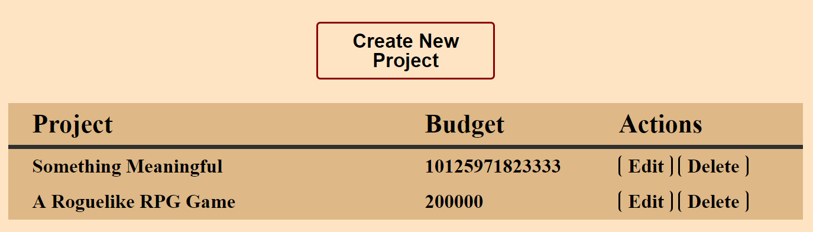
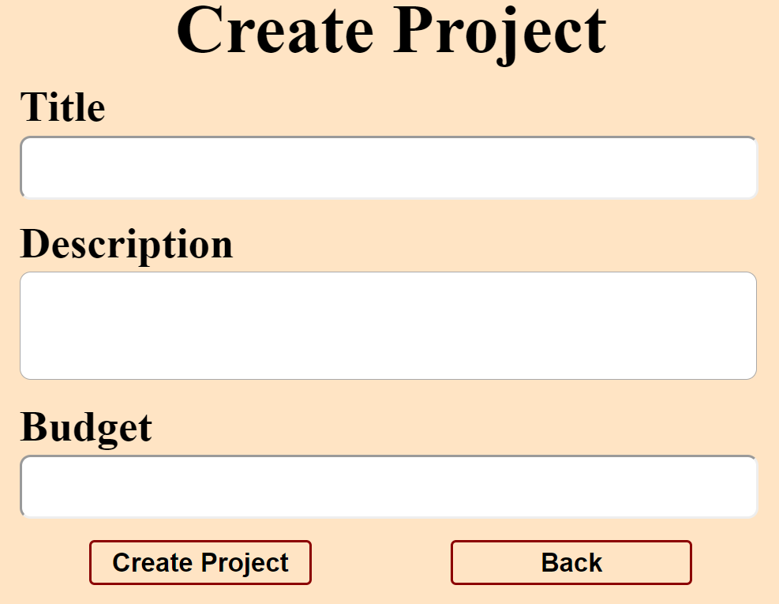
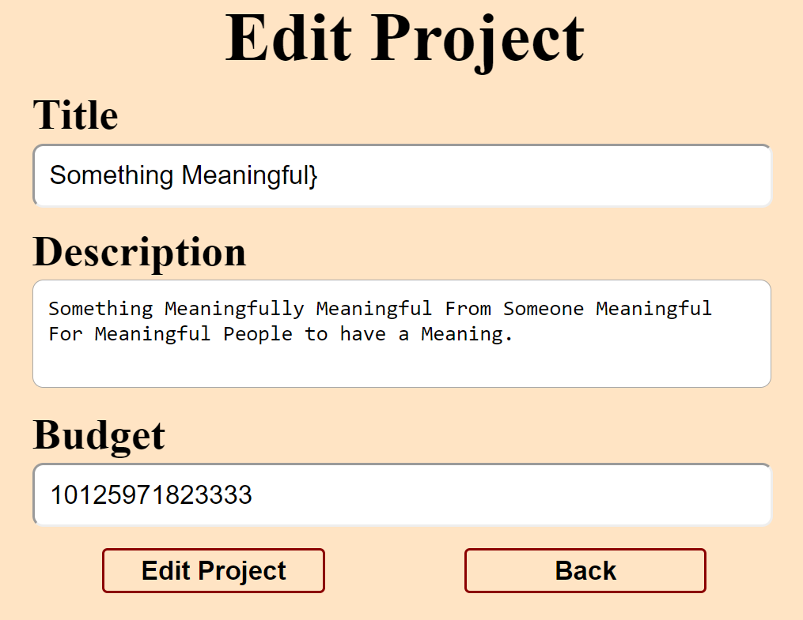
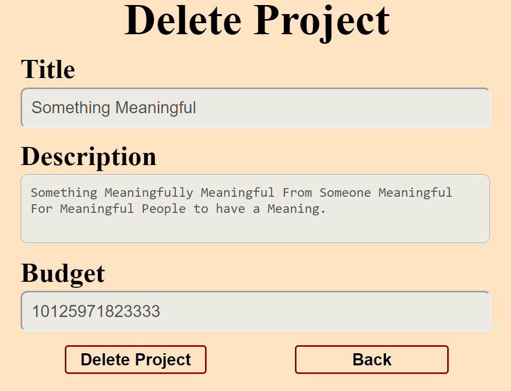

# Practical Exam – Cat Shop

You have the task to create an application for cats. The application should hold **cats**, which are the main app **entities**. The app is called **CatShop**.

The functionality of the application should support **creating**, **listing, editing**, **deleting** cats.

The application should **persist** the data into a MySQL **database**.

## Overview

Your application should be built on **each one **of the **following technologies**:

### JavaScript

* **NodeJS **+** ExpressJS **frameworks

* **Handlebars.js **view engine

* **Sequelize **ORM

* **MySQL **database

### PHP

* **Symfony **framework

* **Twig **view engine

* **Doctrine** ORM

* **MySQL **database

### Java

* **Spring **framework (**Spring MVC** + **Spring Boot** + **Spring Data**)

* **Thymeleaf **view engine

* **JPA **/ **Hibernate ORM **+** Spring Data **data access

* **MySQL **database

### C#

* **ASP.NET Core **framework (**ASP.NET MVC** + **Entity Framework Core**)

* **Razor **view engine

* **Entity Framework Core **ORM

* **MySQL **database

## Data Model

The **Cat** entity holds **4 properties**:

* **id** – technology-dependent identifier (**ObjectID** for JavaScript, **int** for all other technologies)

* **name** – non-empty text

* **nickname**** **– non-empty text

* **price** – double

## Skeletons

You will be given the applications’ **skeletons**, which holds about **90%** of the logic. You’ll be given some **files** (**controllers**, **models** etc.). The files will have** partially implemented logic**, so you’ll need to write some code for the application to **function properly**.

The application’s views will be given to you fully implemented. You only need to include them in your business logic.

**Each technology** will have its **own skeleton**, and the **different** **skeletons** may **differ** in **terms** of **what is given to you** and **what is to be implemented**.

Everything that has been given to you inside the skeleton is **correctly implemented **and if you write your code **correctly**, the application should work just fine. You are free to change anything in the Skeleton on your account.

## User Interface

This is the user interface or how the application’s pages should look in their final form (fully implemented). You have several pages, described below:

### Index Page

#### Route: **"/"**

Displays **all** the **cats** from the database with** options **to **edit **or **delete** them.

### Create Page

#### Route: **"/create"**

### Edit Page

#### Route: **"/edit/{id}"**

### Delete Page

#### Route: **"/delete/{id}"**

## Problem

As you can see the different pages are on different routes. Most of the routing logic will be given to you in the **Skeleton**, but you should make sure that the application **works properly**.

Implement the "**CatShop" app** using all the above described **4 technologies**.

## Setup

Before you start working, make sure you **download all the dependencies** (packages) required for each technology and **set up** the **databases**! Below are instructions on how to do this:

### PHP and Symfony

1. Go into the **root directory** of the project (where the **bin** folder resides)

2. Make sure you’ve started your **MySQL server** (either from **XAMPP** or standalone)

3. Open a **shell** / **command prompt** /** PowerShell** window in the **root directory**: [Shift] + [Right click] ➔ [Open command window here]

4. Enter the "**php composer.phar install**" command to restore its **Composer dependencies** (described in **composer.json**)

5. Enter the "**php bin/console doctrine:database:create --if-not-exists**" command

6. Done!

### JavaScript and Node.js

1. Go into the **root directory** of the project (where the **bin** folder resides)

2. Open a **shell** / **command prompt** /** PowerShell** window in the **root directory**: [Shift] + [Right click] ➔ [Open command window here]

3. Enter the "**npm install**" command to restore its **Node.js dependencies** (described in **package.json**)

4. Create the database needed manually, using the command prompt or your database GUI. 

5. Done!

### C# and ASP.NET

The C# project will automatically resolve its **NuGet dependencies** (described in **packages.config**) using the NuGet package restore when the project is built.

### Java and Spring MVC

The Java project will automatically resolve its **Maven dependencies** (described in **pom.xml**) when the project is built.

